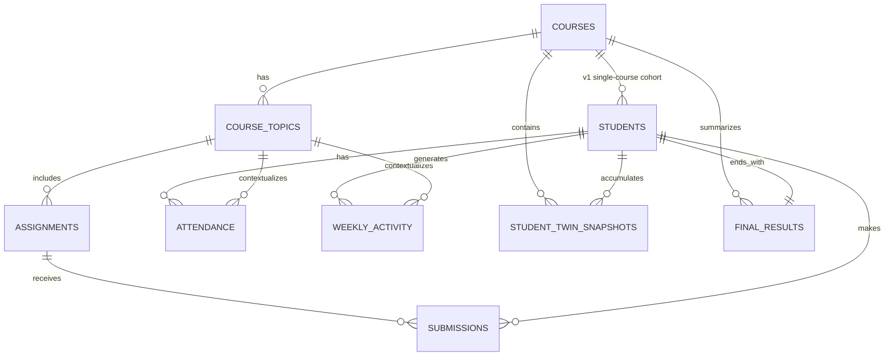

# Entities

## Overview

The v1 data model separates the project into three linked layers:

1. Raw LMS-like data.
2. Processed student digital twin snapshots.
3. End-of-course outcomes.

This keeps the project aligned with the research framing: the system is not just a dashboard of historical events, but a weekly evolving representation of student state.

## Entity Relationship Diagram

## Raw LMS-like Layer

### `students`

Represents the student roster for the synthetic cohort.

In v1, each student is linked directly to one course through `course_id`. This is a practical simplification for the one-course prototype. A dedicated enrollments table may replace this in a later major version.

The table also contains hidden generation-only parameters such as `baseline_level`, `motivation_level`, `discipline_level`, and `trajectory_type`. These exist to make synthetic data behavior plausible, but they are not intended to be exposed in teacher-facing views.

### `courses`

Defines the teaching context for the prototype. In v1 this is expected to be one course, but the table still exists because it provides the anchor for grading policy, duration, and future expansion.

### `course_topics`

Represents the planned instructional structure by week. In the initial design, one topic generally maps to one week of the 10-week course.

This entity gives the dataset a time-aware instructional backbone instead of treating all events as unstructured records.

### `assignments`

Represents assessed learning items such as assignments, quizzes, and lab checks.

Assignments connect the instructional timeline to observed performance and submission discipline. Their type is important because some twin features aggregate assignments and quizzes separately.

### `attendance`

Stores observed participation in scheduled instructional sessions.

Attendance contributes both directly to teacher interpretation and indirectly to twin features such as `attendance_rate_to_date` and `attendance_trend_3w`.

### `submissions`

Represents the student-by-assignment record of whether work was submitted, whether it was late, and what score was earned.

This is the main source for:

- score-based performance indicators,
- missed and late workload indicators,
- on-time submission behavior,
- later end-of-course performance outcomes.

### `weekly_activity`

Represents weekly LMS-like interaction aggregates such as login count, active days, content views, practice events, and time on platform.

Although already aggregated, this still belongs to the raw layer because it describes observed platform behavior before the digital twin feature logic is applied.

## Processed Digital Twin Layer

### `student_twin_snapshots`

This is the central processed table of the v1 design.

Its canonical grain is:

- `1 row = 1 student x 1 week`

Each row is a time-aware student state snapshot derived from raw data available up to that week only. It contains:

- cumulative indicators,
- short-horizon trends,
- mastery-related proxies when enabled by a later minor schema revision,
- limited course-internal context features when enabled by a later minor schema revision,
- interpretable composite indices,
- `risk_score`,
- `risk_level`.

This table is the main bridge between raw educational behavior and teacher-oriented analytics.

## Outcome Layer

### `final_results`

Stores end-of-course realized outcomes such as:

- `final_grade`,
- `passed`,
- `completion_status`.

This layer is intentionally separate from weekly twin state so that downstream modeling can join final outcomes without leaking them into feature generation.

## Relationship Notes

- `course_topics` gives the 10-week course its explicit temporal structure.
- `assignments`, `attendance`, and `weekly_activity` all attach behavior to that weekly structure.
- `submissions` connect students to assessment performance and discipline signals.
- `student_twin_snapshots` aggregates raw signals into a dynamic representation of student state.
- `final_results` stores realized end-of-course outcomes rather than weekly concern levels.

## Modeling Note

`risk_level` belongs to the weekly twin state because it is a teacher-facing weekly concern label.

`final_grade` and `passed` belong to the end-of-course outcome layer because they are realized results observed only after the course completes.

## Research Alignment Note

The current v1 structure already matches the main research recommendation:

- raw LMS-like tables,
- a weekly processed twin layer,
- a separate outcome layer.

After the literature review, two feature families look especially worthwhile to keep in view:

- mastery progression proxies,
- limited course-internal context such as topic difficulty and due-load.

These do not require a structural redesign of the current v1 model. They can be introduced later as carefully versioned field additions or derived features once the first synthetic generator and validation pipeline are in place.
