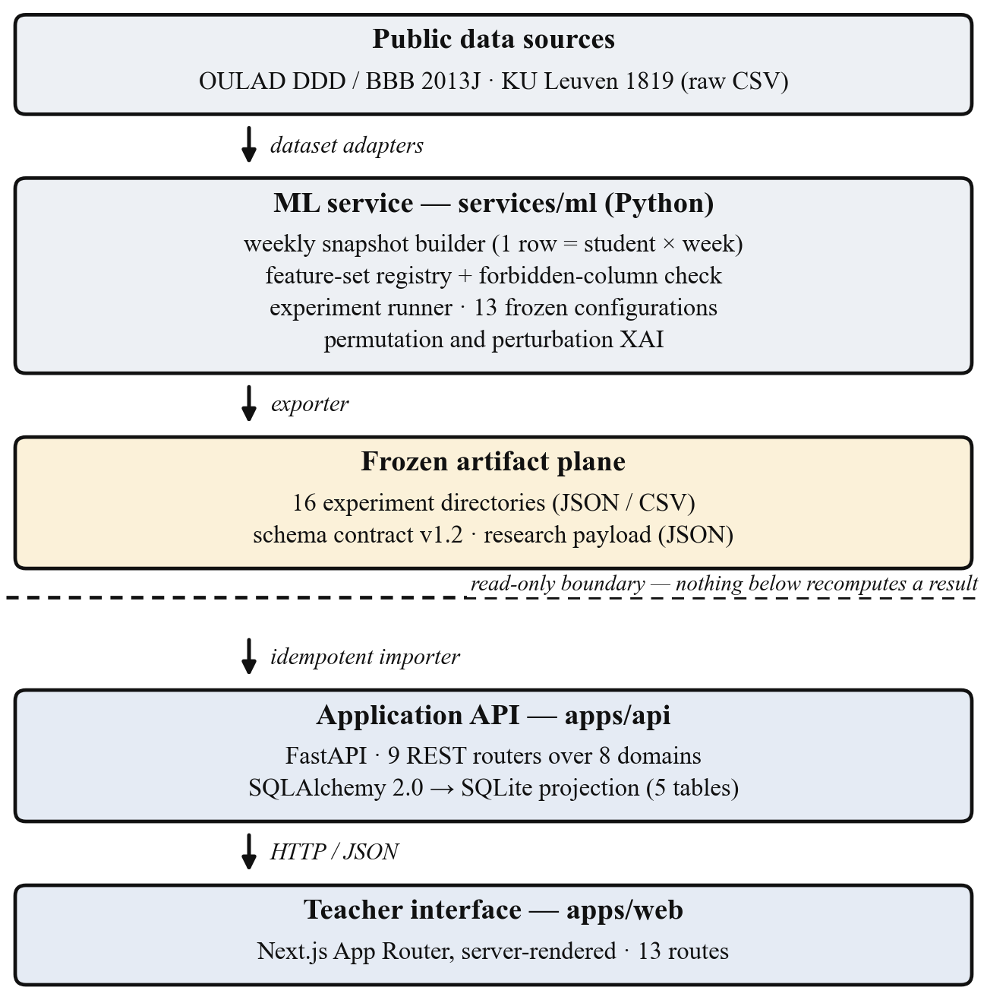
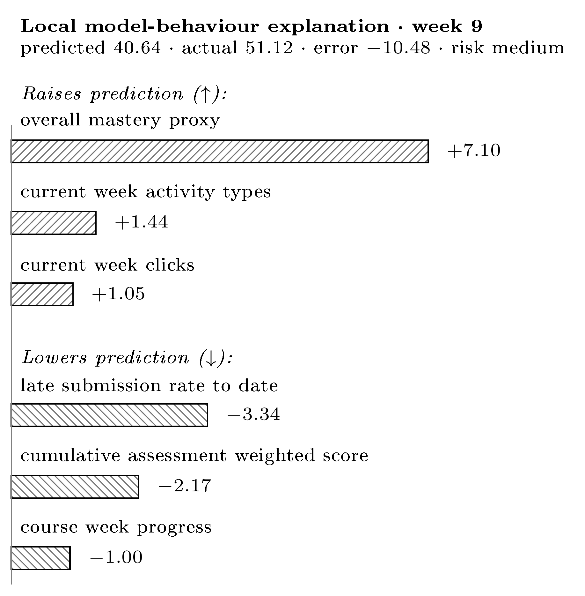

<!-- Generated from IEEE_Talgatov.docx (revision 2, 2026-07-26). The .docx is
     the submitted artifact; regenerate this file rather than editing it by hand. -->

# Explanation Stability and Feature Richness in a Teacher-Facing Student Digital Twin

**A. S. Talgatov**  
Master degree student  
School of Software Engineering  
Astana IT University  
Astana, Kazakhstan  
ORCID: 0009-0006-3463-4644  
a1byn.talgat05@gmail.com  

**S. A. Nurgaliyeva***  
PhD in computer science  
School of Software Engineering  
Astana IT University  
Astana, Kazakhstan  
ORCID: 0009-0009-5880-6166  
symbat.nurgaliyeva@astanait.edu.kz  

**Abstract**— Learning management systems (LMS) record large volumes of educational activity, but their built-in analytics remain descriptive rather than predictive or explanatory. This paper presents an open, reproducible software system that closes the loop from raw public learning-analytics data to per-student grade predictions, pass-risk flags, and model-behaviour explanations delivered in a teacher interface. The prototype is engineered as three runnable services — a Python ML service, a FastAPI application service over a relational projection, and a server-rendered Next.js interface — arranged around a frozen, contract-governed artifact plane, with a strict read-only boundary that keeps every reported number reproducible independently of the interface. On this platform we run a dependency-driven sequence of frozen experiments and ask a falsifiable question: do engineered Digital-Twin features improve prediction over a competent LMS baseline, and are the explanations stable? On the Open University Learning Analytics Dataset (OULAD) module DDD 2013J (1,938 students, 67,830 weekly snapshots) the full Twin ablation is mixed-to-null — no Twin block beats the LMS baseline by more than 1.0 RMSE — while on a second cohort (BBB 2013J) a mastery block improves the temporal-forward split by −1.026 RMSE and nothing else, a direction confirmed by student-clustered bootstrap. A second institution (KU Leuven, 1,495 students) cannot even support the mastery ablation. Across three real cohorts and two institutions, adding feature richness does not robustly help, and the XAI importance rankings are regime-sensitive (Kendall τ 0.55–0.79 within a course, 0.32–0.61 across courses). The contribution is the engineered, leakage-aware platform together with an honest multi-cohort evaluation — including a documented synthetic-target circularity failure mode — rather than an accuracy record.

***Keywords**—learning analytics; explainable AI; explanation stability; software architecture; reproducible research; student performance prediction; OULAD; digital twin; gradient boosting; permutation importance; honest negative result*

## I. INTRODUCTION

Learning management systems capture attendance, submissions, marks, and clickstream activity, yet the analytics layered on top of them rarely close the loop from raw event data to an explained, forward-looking estimate that an instructor can inspect. Most published learning-analytics work optimises a classifier on a held-out split, appends post-hoc explanations, and reports the best configuration on a single cohort; the software around that model is seldom described and almost never released. Three questions are therefore left open: whether a Digital-Twin representation of student state adds defensible value over a plain LMS feature set, whether the resulting explanations are stable enough to expose in an interface, and whether the whole cycle can be engineered so that it reproduces.

This paper answers those questions with a working system and an explicitly honest evaluation. The modelled object is the student as a **dynamic digital twin**: weekly state snapshots at the grain *1 row = 1 student × 1 week*. The term denotes a lean, time-aware state representation, not a counterfactual simulation engine; the twin maintains a descriptive weekly state plus a lightweight perturbation-based what-if layer, and full simulation and causal reasoning are explicit design boundaries (Section VIII). Around this representation we engineer a four-layer platform: an ML service that turns raw institutional exports into frozen, versioned artifacts; an artifact plane governed by a schema contract; an application service that projects those artifacts into a queryable store; and a server-rendered teacher interface. A read-only boundary between the computing and the serving halves is the central architectural invariant.

The novelty is not a new algorithm or a higher accuracy number. It is the combination of (1) an engineered, open, leakage-aware platform whose computation and presentation layers are separated well enough that every reported number can be regenerated without the interface; (2) a dependency-driven ablation that tests the Twin representation instead of assuming it; (3) an explanation-stability analysis across splits, courses, and institutions; and (4) an **honest multi-cohort finding** — including a documented synthetic-data circularity failure mode — of a kind systematically underrepresented in the literature.

## II. RELATED WORK

**Explainable prediction on OULAD.** Training gradient boosting or random forests on OULAD and attaching SHAP explanations post-hoc is now standard practice [4]–[7], with published benchmarks reaching ROC-AUC 0.993 and F1 0.911 on dropout prediction [4]. What these studies share is a reporting unit — one best configuration on one cohort — that cannot separate a genuine representational gain from a favourable split. Explainability is therefore no longer a contribution by itself; the open question is what survives when the same pipeline is re-run under a different regime.

**Explanation stability.** Tiukhova et al. [2] showed that XAI-derived feature importance for student-success models is unstable across model configurations. That result is confined to a single dataset and a single modelling setting. We extend the stability lens to a *transfer* setting — rank agreement across evaluation splits, across two OULAD courses, and across institutions — because it is transfer, not configuration, that a deployed interface actually faces.

**Digital twins in education.** Digital twins in education appear predominantly as conceptual or review work [8]; working implementations on real student data are essentially absent, so the term carries no agreed engineering content. Teacher-facing interfaces in peer-reviewed work publish model metrics rather than systems, and commercial platforms (EAB Navigate, Civitas Learning, Brightspace Insights) ship dashboards that are closed and undocumented. Neither line reports an architecture a third party could rebuild.

**Engineering and reproducibility.** Sculley et al. [14] characterise ML systems as prone to entanglement, in which undeclared data dependencies make an observed result hard to attribute to any one component. Kapoor and Narayanan [15] document leakage as a recurring cause of irreproducible ML-based science. Both concerns are structural rather than statistical, and both motivate design decisions taken here: an explicit feature-set registry with machine-checked forbidden columns, a versioned schema contract, and a read-only boundary that prevents the serving layer from silently recomputing a reported number.

**Research gap.** No published work engineers and honestly evaluates a full-cycle prototype — raw data → weekly twin snapshots → predictions → per-student explanations → teacher interface — on real public data, documenting both its architecture and the places where its added components fail to beat a simpler baseline. This paper targets that gap.

## III. SYSTEM ARCHITECTURE

The prototype is a monorepo containing three independently runnable services and a data plane between them (Fig. 1). The decomposition follows a single invariant: *the layer that serves a result must never be able to compute it.*

**ML service (services/ml, Python).** Owns everything that touches raw data: dataset adapters, the weekly snapshot builder, the feature-set registry, the experiment runner, model training, and the perturbation-based XAI module. It writes versioned JSON/CSV artifacts under data/artifacts/experiments/ and never serves a request.

**Artifact plane.** Frozen experiment outputs plus one exported research payload. Their structure is governed by a versioned schema contract (schema_v0.1–v1.2) held in packages/contracts, so a change in snapshot semantics is a reviewable contract change rather than an implicit break.

**Application service (apps/api, FastAPI).** Projects the research payload into a relational store and exposes it through nine REST routers. It performs no training and no explanation computation.

**Teacher interface (apps/web, Next.js).** Server-rendered views over that API, with no direct access to the ML stack.

**The read-only boundary.** Because the interface can neither retrain a model nor recompute an explanation, results are reproducible without running the frontend, the frontend is testable without the ML stack, and any divergence between a reported and a displayed number must originate in the exporter — a single auditable component. Section VI-B reports a case where this mattered: re-executing a frozen pipeline under a newer runtime moved a point estimate materially, and the boundary is what made that drift measurable rather than invisible.

***Fig. 1.** Layered component and deployment view. Three runnable services surround a frozen artifact plane; the dashed line marks the read-only boundary below which no reported number is recomputed.*

**Teacher-facing views.** A cohort dashboard presents a sortable, filterable table of all students with predicted grade, pass-risk badge, current week, and key LMS signals, supporting one-click filtering to the high-risk group. A per-student view adds summary cards, a weekly trajectory chart of predicted grade, mastery, activity and risk, the raw weekly-snapshot table, an explanation panel (Fig. 2), and a what-if panel estimating the predicted-grade gain if each flagged below-median factor reached the cohort median. The explanation panel carries an explicit limitation notice: the factors describe *model behaviour, not causes*; the score is not a sole basis for intervention; and rankings shift across time periods and cohorts. We present the interface as a *design demonstrator* whose presentation of XAI output follows from the explanation-stability result of Section VI-C, not as an evaluated intervention; no user study is claimed here.

## IV. IMPLEMENTATION AND DEPLOYMENT

### A. Technology stack

Table I summarises the stack by component. Dependency versions are pinned per service (uv.lock for Python, pnpm-lock.yaml for TypeScript) so that an experiment run and an interface build can both be reconstructed from the repository alone.

**TABLE I  IMPLEMENTATION STACK BY COMPONENT**

| Component | Technology (pinned) | Responsibility |
|---|---|---|
| Teacher interface | Next.js 14.2, React 18.3, TypeScript 5.5, Tailwind 4 | 13 server-rendered routes; no computation |
| Application API | FastAPI, Pydantic v2, SQLAlchemy 2.0, SQLite | 9 REST routers over 8 domains; relational projection |
| ML service | Python 3.11, pandas 2.2, NumPy 2.1, scikit-learn 1.5, PyArrow | Adapters, snapshots, experiment runner, XAI |
| Artifact plane | Versioned YAML schema contract; JSON/CSV | Contract v1.2; 16 frozen experiment directories |
| Build and runtime | Docker Compose, uv, pnpm, ruff, ESLint, pre-commit | Pinned locks, per-service images, quality gates |

### B. ML pipeline

Institutional exports enter through dataset adapters — one for OULAD, one for the KU Leuven release — that normalise heterogeneous source tables into a common weekly frame. The snapshot builder emits one row per student per week. Feature sets are not assembled ad hoc: each is a frozen, named tuple of column names declared in a registry module, and every set is validated at import time against a 15-entry forbidden-column set covering identifiers, outcome-layer fields, and generator-only latent variables. Leakage control is therefore a machine-checked property of the code rather than an assurance in prose. The experiment runner consumes a YAML configuration — thirteen are versioned in the repository — performs train-only imputation, fits the configured estimators, and writes metrics, split metadata, and explanation tables into a per-experiment artifact directory.

### C. Application service

The API is organised by domain rather than by technical layer: each of eight domains (students, twins, predictions, explanations, interventions, dashboard, platform, research) owns a router, a service, and a repository, so one domain can be read or replaced without traversing the whole codebase. Persistence uses SQLAlchemy 2.0 declarative models over five tables — students, weekly twin snapshots, explanation cases, per-feature contributions, and a research-metadata row recording which artifacts the current projection came from. Configuration is typed through pydantic-settings. A startup lifespan hook creates the schema and, when the store is empty, seeds it from the exported payload; the importer clears and rewrites the projection, which makes re-seeding idempotent.

### D. Teacher interface

The frontend is a Next.js App Router application of thirteen server-rendered routes. Typed loaders wrap every API call and degrade to an explicit unavailable state instead of failing the render, so the interface stays inspectable when the API is down — a property that matters for a research artifact examined by readers who will not run the full stack.

### E. Component integration

The chain from evidence to screen is: frozen artifacts → exporter → a single camelCase JSON payload → importer → relational projection → REST → server-rendered view. The payload is the contract between the research half and the application half and is the only channel between them, which is what makes the read-only boundary enforceable rather than aspirational. For the OULAD DDD 2013J demonstration the projection holds 150 students sampled stratified by observed pass and derived risk, 5,250 weekly snapshots, and four fully explained representative cases.

### F. Deployment, quality gates, and reproducibility

Each service ships a container image, composed on a single host together with a Postgres service reserved for the planned persistence migration. Static quality gates run through pre-commit hooks: ruff and ruff-format for Python, ESLint for TypeScript. The ML service carries 26 test modules (approximately 4.9k lines) covering adapters, splits, preprocessing, feature-set validity, stability analysis, and each experiment runner; the application service is covered by route and importer tests. Randomness is seeded explicitly and split composition is written into every artifact. What is deliberately absent matters equally for judging scope: there is no authentication, no multi-tenancy, and no production hardening, because the system is a research instrument rather than a deployed institutional product.

## V. DATA AND EXPERIMENTAL DESIGN

### A. Datasets

We evaluate on real, public, non-circular data from two institutions: OULAD DDD 2013J (1,938 students, 67,830 weekly snapshots, weeks 4–38) and OULAD BBB 2013J (2,237 students, 80,532 snapshots, with a richer dated assessment structure) [1], plus KU Leuven 1819 (1,495 students, two courses pooled, weeks 2–15) [3]. A separate synthetic dataset is used only for controlled methodological checks; its limitations are stated in Section VIII.

### B. Feature sets (nested ablation)

The Digital-Twin representation is tested by decomposition, not assumed: `A_simple` (minimal baseline); `B_lms` (LMS behavioural features, the proxy for what the literature uses); `B_lms+mastery` (LMS plus a lean mastery-proxy block derived from the dated assessment structure); and `C_twin` (the full engineered Twin representation: trends, mastery, indices, temporal context). Each set is a strict superset of the previous one, so the Twin is tested block by block rather than accepted as a whole.

### C. Models and protocol

Model families are deliberately simple and defensible: Ridge regression, Logistic Regression, Random Forest, and Gradient Boosting. Two splits are used: a student-grouped split (primary; test_size = 0.25, seed = 42; for DDD: 1,454 train vs. 484 test students) and a temporal-forward split (train on early weeks, predict later weeks). The pipeline is leakage-aware: train-only preprocessing, explicit forbidden-column enforcement, and fixed-model reporting (Gradient Boosting held fixed across splits) to neutralise best-model-per-cell selection artifacts. Targets: `final_weighted_score` (regression, 0–100) and `passed_observed` (binary classification).

## VI. RESULTS

### A. This work vs. standard baselines

All rows in Table II use OULAD DDD 2013J, the `B_lms` feature set, and the student-grouped split, except the last “ours” row, which adds the mastery block. RMSE is on the 0–100 score scale; F1 and ROC-AUC are for `passed_observed`.

**TABLE II  THIS WORK VS. STANDARD BASELINES**

| Approach | RMSE | F1 | AUC | XAI | UI | Open |
|---|---|---|---|---|---|---|
| Logistic Regression (ours) | – | 0.854 | 0.951 | No | No | Yes |
| Random Forest (ours) | 13.633 | 0.861 | 0.947 | No | No | Yes |
| GB LMS-only (ours) | 12.658 | 0.863 | 0.953 | No | No | Yes |
| GB + Twin + XAI (this work) | 12.724 | 0.861 | 0.953 | Yes | Yes | Yes |
| GB + SHAP (literature) [4] | – | 0.911 | 0.993 | Yes | No | Part. |

Gradient Boosting on `B_lms` is the strongest baseline (RMSE 12.658, F1 0.863, ROC-AUC 0.953) and Ridge regression the weakest (RMSE 14.318). Logistic Regression is already competitive (F1 0.854, ROC-AUC 0.951), reflecting that the dominant predictor — assessment submission rate — is approximately linear in the log-odds of passing. Adding the mastery (Twin) block changes RMSE by +0.066 (worse) and F1 by −0.002: no improvement on this cohort and split. This is the honest negative result, stated rather than hidden.

### B. When does the Twin help, and when not?

The full nested ablation under fixed-model reporting gives a course- and split-dependent answer (Table III).

**TABLE III  MASTERY BLOCK VS. THE LMS BASELINE, BY COHORT AND SPLIT (RMSE DELTA; LOWER IS BETTER)**

| Cohort | Student-grouped | Temporal-forward |
|---|---|---|
| DDD 2013J | null (mastery +0.061) | weak: mastery −0.381 |
| BBB 2013J | null (all within 0.087) | largest gain: mastery −1.026 |
| KU Leuven 1819 | not buildable | not buildable |

On DDD, no Twin block beats `B_lms` by more than 1.0 RMSE on either split, the full `C_twin` stays within ±0.025 RMSE (non-inferior, not better), and the minimal `A_simple` is clearly worse (+1.207 grouped, +4.105 temporal-forward), confirming that the LMS layer already carries the signal. On BBB, whose assessment structure is richer, the mastery block improves temporal-forward by −1.026 RMSE (6.311 → 5.284) and the full `C_twin` by −0.765, but the student-grouped split stays null and the trend and index blocks are null on both courses.

**Reading.** Engineered Twin value is *heterogeneous*: it appears only under forward-time prediction on a course with rich assessment structure, and disappears under the student-grouped regime. To test whether the single positive cell is an artefact of one test split, we re-ran the frozen BBB 2013J pipeline under a student-clustered bootstrap (5,000 resamples of the 559 held-out test students, seed = 42) in a newer runtime, in which the temporal-forward baseline RMSE drifted 21.6% from the stored value against only 1.7% on the student-grouped split. On reproduced estimates the 95% CI of the mastery RMSE reduction lies entirely below zero on temporal-forward ([−2.54, −1.80]; one-sided P(Δ ≥ 0) = 0.000) and crosses zero on student-grouped ([−0.17, +0.03]; P = 0.082), corroborating both the positive and the null cell. We therefore treat the direction as robust and make no claim about a stable effect size. The classification target stays genuinely predictive throughout (best-model F1 0.83–0.93, never 1.000), which is what makes this negative finding trustworthy.

### C. XAI and explanation stability

Explanations use held-out **permutation importance**, model-native importance, and one-feature local median-replacement perturbation. We deliberately avoid SHAP: Shapley-value attributions rest on a background or conditional-expectation estimate that is fragile on the small per-student samples surfaced in the interface, and they carry documented conceptual and robustness problems as feature-importance measures [12], [13]; the perturbation method instead operates directly on the single prediction row shown to the teacher, with no background-set assumption. On DDD the dominant factor is `assessment_submission_rate_due_to_date` (importance share 0.28–0.38; 0.381 in the headline model) and, once mastery is included, the co-circular `overall_mastery_proxy` (0.23–0.43). The genuinely exogenous signals — `is_unregistered_by_week` (0.13–0.20) and VLE clickstream (0.02–0.06) — are interpretable but carry modest weight (Fig. 2).

***Fig. 2.** Per-student explanation panel in the running interface: signals raising vs. lowering the predicted grade (RMSE-scale points), dual-coded by sign and hatch for greyscale, shown with the XAI limitation notice.*

The rankings are **not invariant**. Within a course, across splits: Kendall τ = 0.79 / 0.68 / 0.55 for `B_lms` / +mastery / `C_twin` (mean 0.67); none reach 0.90. Across courses (DDD vs. BBB): τ = 0.32–0.61 (mean 0.52) — even less stable. Across three institutions on an engagement-only task: mean τ ≈ 0.56; clicks and active-days recur as top drivers, but the mid and lower ordering is institution-specific. Stability therefore degrades monotonically as the evaluation regime moves further from training, and never reaches the τ = 0.90 threshold conventionally treated as agreement.

A controlled synthetic faithfulness probe confirms the method is faithful when ground truth is known: at the final course week, permutation importance recovers the generator's weight *ordering* exactly (Kendall τ = 1.0). The same few features dominate across regimes but reorder, so explanations must be framed as model behaviour under a particular evaluation scenario, not as stable causal rankings.

### D. Second institution

KU Leuven exposes clickstream and course structure but no intermediate scored assessments and no continuous grade — only a binary PASSED outcome — so the mastery/Twin ablation cannot be built there at all, itself a cross-institution heterogeneity result. On its engagement-only task prediction is modest (F1 0.74–0.76, ROC-AUC 0.66–0.70) and a richer engagement set does not beat a minimal two-feature one (F1 delta −0.015 / +0.000). A matched three-institution synthesis on the temporal-forward split confirms that a two-feature baseline (clicks + active-days) is hard to beat (F1 delta spread −0.016 to +0.026); on the student-grouped split richer engagement helps more, particularly on OULAD (up to +0.072), so this baseline-sufficiency finding is split-specific rather than universal.

## VII. DISCUSSION

Three points follow. First, on the **central question** — do Twin features beat a competent LMS baseline? — the honest answer across three real cohorts and two institutions is *not robustly*. The benefit is real but narrow (BBB, temporal-forward, mastery) and vanishes under the stricter student-grouped regime, on other courses, and on other blocks. Reporting only the favourable cell, as is common, would have manufactured a false “Twin wins” narrative.

Second, **explanations are regime-dependent**, with a direct engineering consequence: an interface must present XAI output as how the model weights each signal for this prediction, not why this student is at risk. Our explanation panel encodes exactly that caveat, and its wording was derived from the stability measurement rather than chosen editorially.

Third, **the architecture earned its keep in an unanticipated way**. Freezing artifacts behind a read-only boundary turned a runtime upgrade into a measurable event rather than a silent change: the drift reported in Section VI-B was detectable only because the stored artifact and the re-executed pipeline were separable and comparable, whereas a system whose serving layer could recompute results would have absorbed it invisibly. This is a concrete instance of the entanglement problem described in [14], and it suggests that for learning-analytics prototypes the artifact boundary is a research instrument, not merely a deployment convenience. Read on three axes rather than accuracy alone, the work is comparable to standard baselines and below the published best (ROC-AUC 0.953 vs. 0.993 [4]); it provides per-student, background-free perturbation explanations with documented stability limits; and on engineering completeness it is, to our knowledge, the most complete openly documented artifact of its kind.

## VIII. LIMITATIONS AND THREATS TO VALIDITY

**Synthetic circularity (documented failure mode).** During development a synthetic target manufactured an apparent mastery win. The synthetic final_grade is a deterministic, noise-free weighted mean of the same behaviours the features re-aggregate (week-10 reconstruction error 0.008, correlation 1.000000), so the resulting R² ≈ 0.99 and saturated passed F1 = 1.000 are **algebraic artifacts, not learnable signal**. A circular target can fabricate a feature-group advantage that vanishes on genuine data.

**Target and construct circularity on OULAD.** `final_weighted_score` is partly fed by assessment scores, so the regression results lean somewhat on within-system accounting; the classification target and the VLE clickstream are the cleaner, exogenous evidence. Relatedly, `overall_mastery` is close to cumulative LMS performance (|r| = 0.993 with `avg_assignment_score`) and must not be presented as an independent construct.

**No user evaluation of the interface.** The interface is a design demonstrator. Its presentation of XAI output as model-behaviour-under-a-scenario follows directly from the explanation-stability result, but we make no claim about its effect on teacher understanding or decisions; a qualitative or controlled study with instructors is left to future work.

**External validity.** Evidence spans two OULAD courses at one institution plus a second institution that cannot test the mastery ablation, which supports the narrow claim that feature richness does not robustly help rather than a like-for-like institutional replication. Explanations are not causal and not SHAP, and the what-if layer is a first-order perturbation estimate rather than a mechanistic simulation.

**Environment sensitivity.** Gradient Boosting point estimates on the BBB 2013J temporal-forward split shifted materially under a different Python/scikit-learn runtime (21.6% RMSE drift; Section VI-B) versus 1.7% on the student-grouped split. The direction of the mastery effect was confirmed stable by bootstrap, but its magnitude should not be treated as environment-invariant.

**Deployment scope.** The system runs as a single-host composition without authentication, multi-tenancy, or live LMS integration, and the relational projection is a research store rather than an institutional database of record. Deployment inside a university would require all three and is deliberately out of scope for this work.

## IX. CONCLUSION

We presented an engineered, explainable, teacher-facing Student Digital Twin and evaluated it honestly across two institutions. The system contribution is a four-layer platform with a contract-governed artifact plane and a read-only boundary that keeps every reported number reproducible independently of the interface. The empirical contribution is negative, and deliberately so: on real, non-circular OULAD data the engineered Twin features deliver no consistent advantage over a competent LMS baseline — mixed-to-null on DDD 2013J and heterogeneous on BBB 2013J (mastery −1.026 RMSE on temporal-forward only, direction confirmed by bootstrap) — and a second institution cannot even build the ablation. The explanations are regime-sensitive within a course (Kendall τ 0.55–0.79) and partly course-specific across courses (0.32–0.61). The contribution is therefore system-level and methodological rather than an accuracy record. Future work includes external validation across more institutions, a study with instructors, and validated counterfactual reasoning.

## Data and Code Availability

All datasets are public and openly licensed: OULAD under CC-BY 4.0 [1] and the KU Leuven activity/performance dataset under CC-BY 4.0 via Zenodo [3]. Both were obtained from their public releases; the authors report no affiliation with or competing interest in the dataset providers. All experiment code, configuration, and frozen result artifacts are available at https://github.com/a169n/student-digital-twin-xai.

## References

[1] J. Kuzilek, M. Hlosta, and Z. Zdrahal, “Open University Learning Analytics dataset,” Scientific Data, vol. 4, art. 170171, 2017, doi: 10.1038/sdata.2017.171.

[2] E. Tiukhova et al., “Explainable Learning Analytics: Assessing the stability of student success prediction models by means of explainable AI,” Decision Support Systems, vol. 182, art. 114229, 2024, doi: 10.1016/j.dss.2024.114229.

[3] E. Tiukhova, D. Van Landuyt, B. Baesens, and M. Snoeck, “Open data, private learners: a de-identified student activity and performance dataset for learning analytics,” Scientific Data, vol. 13, art. 548, 2026, doi: 10.1038/s41597-026-06821-3.

[4] J. López de la Rosa et al., “A Modular and Explainable Machine Learning Pipeline for Student Dropout Prediction in Higher Education,” Algorithms, vol. 18, no. 10, art. 662, 2025, doi: 10.3390/a18100662.

[5] S. Boujmiraz, H. Darhmaoui, and A. Drissi el Maliani, “Predicting student performance: A comprehensive review of machine learning, deep learning, and explainable AI approaches,” Computers and Education: Artificial Intelligence, vol. 10, art. 100548, 2026, doi: 10.1016/j.caeai.2026.100548.

[6] F. T. Johora, M. N. Hasan, A. Rajbongshi, M. Ashrafuzzaman, and F. Akter, “An explainable AI-based approach for predicting undergraduate students’ academic performance,” Computers and Education Open, 2025.

[7] W. Villegas-Ch et al., “Machine learning models for academic performance prediction: interpretability and application in educational decision-making,” Frontiers in Education, vol. 10, art. 1632315, 2025, doi: 10.3389/feduc.2025.1632315.

[8] M. Furini et al., “Digital twins and artificial intelligence as pillars of personalized learning models,” Communications of the ACM, vol. 65, no. 4, pp. 98–104, Apr. 2022, doi: 10.1145/3478281.

[9] S. M. Lundberg and S.-I. Lee, “A unified approach to interpreting model predictions,” in Advances in Neural Information Processing Systems (NeurIPS), vol. 30, 2017, pp. 4765–4774.

[10] L. Breiman, “Random forests,” Machine Learning, vol. 45, no. 1, pp. 5–32, 2001, doi: 10.1023/A:1010933404324.

[11] J. H. Friedman, “Greedy function approximation: a gradient boosting machine,” Annals of Statistics, vol. 29, no. 5, pp. 1189–1232, 2001, doi: 10.1214/aos/1013203451.

[12] I. E. Kumar, S. Venkatasubramanian, C. Scheidegger, and S. Friedler, “Problems with Shapley-value-based explanations as feature importance measures,” in Proc. 37th Int. Conf. Machine Learning (ICML), 2020, pp. 5491–5500.

[13] D. Slack, S. Hilgard, E. Jia, S. Singh, and H. Lakkaraju, “Fooling LIME and SHAP: Adversarial attacks on post hoc explanation methods,” in Proc. AAAI/ACM Conf. AI, Ethics, and Society (AIES), 2020, pp. 180–186.

[14] D. Sculley et al., “Hidden technical debt in machine learning systems,” in Advances in Neural Information Processing Systems (NeurIPS), vol. 28, 2015, pp. 2503–2511.

[15] S. Kapoor and A. Narayanan, “Leakage and the reproducibility crisis in machine-learning-based science,” Patterns, vol. 4, no. 9, art. 100804, 2023, doi: 10.1016/j.patter.2023.100804.
