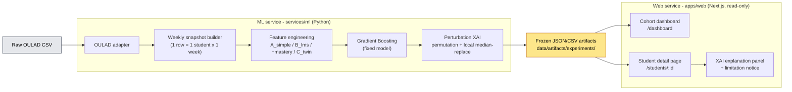
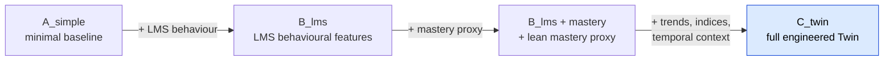
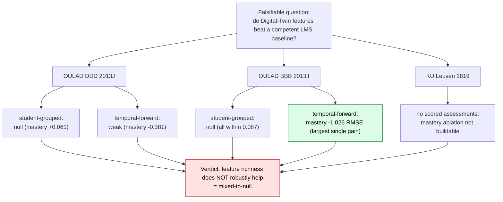
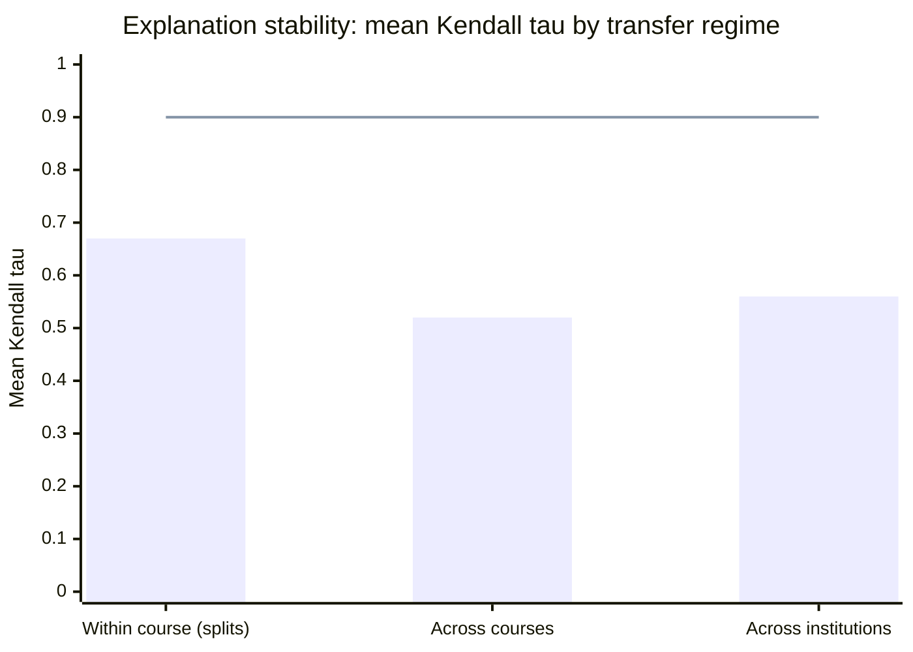

# Does Feature Richness Help? A Reproducible, Honest Evaluation of a Student Digital Twin and Its Explanation Stability Across Two Institutions

> **Submission note (remove before submission).** Primary target: the **IEEE SIST
> 2026** conference, Computational Intelligence track (Applications of CI in
> Education). Reformat to the IEEE conference two-column template before submission
> and **export the inline Mermaid diagrams (Fig. 1, 4, 5, 7) to static images** —
> Mermaid source does not render in a PDF. Author block and ORCIDs are placeholders
> — fill in co-authors and affiliations. All numbers are taken verbatim from the
> frozen experiment artifacts in `data/artifacts/experiments/` and the dissertation
> synthesis in `docs/dissertation/`. The work also fits a learning-analytics venue
> (LAK / EDM / *Computers and Education: AI*) if a higher-impact venue is preferred
> later; that route would keep this question-style title and convert the references
> to the venue style.

---

**Aibyn Talgat\***
School of Software Engineering
Astana IT University
Astana, Kazakhstan
a1byn.talgat05@gmail.com
ORCID: 0000-0000-0000-0000

**Co-author 2**   
Affiliation
City, Country
email
ORCID: 0000-0000-0000-0000

**Co-author 3**
Affiliation
City, Country
email
ORCID: 0000-0000-0000-0000

---

## Abstract

Learning management systems (LMS) record large volumes of educational activity,
but their built-in analytics are mostly descriptive rather than predictive or
explanatory. This paper presents a teacher-facing **Student Digital Twin** — a
lean, time-aware weekly student-state representation — coupled with an
**Explainable AI (XAI)** layer and an end-to-end interface that turns raw public
learning-analytics data into per-student grade predictions, pass-risk flags, and
model-behaviour explanations. Rather than reporting a single best configuration,
we run a dependency-driven sequence of frozen experiments and ask a falsifiable
question: *do engineered Digital-Twin features improve prediction over a competent
LMS baseline, and are the explanations stable?* On the Open University Learning
Analytics Dataset (OULAD) module DDD 2013J (1,938 students, 67,830 weekly
snapshots) the full Twin ablation is **mixed-to-null** — no Twin block beats the
LMS baseline by more than 1.0 RMSE — while on a second cohort (BBB 2013J) a
mastery block improves the temporal-forward split by −1.026 RMSE but nothing else.
A second institution (KU Leuven, 1,495 students) cannot even support the mastery
ablation. Across three real cohorts and two institutions, **adding feature
richness does not robustly help**, and the XAI importance rankings are
regime-sensitive (Kendall τ 0.55–0.79 within a course, 0.32–0.61 across courses).
The contribution is a reproducible, leakage-aware prototype with a teacher UI and
an honest, multi-cohort evaluation — including a documented synthetic-target
circularity failure mode — rather than an accuracy record.

**Keywords—** learning analytics; explainable AI; explanation stability; student
performance prediction; OULAD; digital twin; gradient boosting; permutation
importance; teacher-facing dashboards; reproducibility; honest negative result

## I. Introduction

Learning management systems capture attendance, submissions, marks, and
clickstream activity, yet teachers still lack an integrated, forward-looking view
of a student's evolving academic state, the likely end-of-course outcome, and the
factors behind that estimate. Most published learning-analytics work optimises a
classifier for accuracy on a held-out split and appends post-hoc explanations,
reporting only the best configuration on a single cohort. This leaves three
practical questions unanswered: whether a *Digital-Twin* representation of student
state adds defensible value over a plain LMS feature set, whether the resulting
explanations are stable enough to show a teacher, and whether the whole cycle can
be implemented and reproduced on real public data.

This paper addresses those questions with a working prototype and an explicitly
honest evaluation. The central object is the student modelled as a **dynamic
digital twin**: weekly state snapshots at the grain *1 row = 1 student × 1 week*.
The term "Digital Twin" here denotes a lean, time-aware state representation, not
a full counterfactual simulation engine. We retain the term deliberately but scope
it narrowly: the twin maintains a *descriptive* weekly state and includes a
lightweight SHAP-based what-if layer — estimating the predicted-grade change if a
flagged factor reached its cohort median — rather than a mechanistic simulation.
Full simulation and causal counterfactual reasoning are treated as explicit design
boundaries (Section VII) rather than implicit promises. Around this representation we build a
gradient-boosting predictor, a perturbation-based XAI layer, and a Next.js
teacher interface that reads frozen prediction artifacts.

The novelty is not a new algorithm or a higher accuracy number. It is the
combination of (1) an end-to-end, open, leakage-aware pipeline from raw OULAD data
to teacher-facing weekly explanations; (2) a dependency-driven ablation that tests
the Twin representation instead of assuming it; (3) an explanation-stability
analysis across splits, courses, and institutions; and (4) an **honest
multi-cohort finding** — including a documented synthetic-data circularity failure
mode — of a kind systematically underrepresented in the literature.

## II. Related Work

**SHAP + gradient boosting on OULAD.** Training gradient boosting or random
forests on OULAD and adding SHAP explanations post-hoc is now standard practice
[4]–[7]. Published benchmarks reach ROC-AUC 0.993 and F1 0.911 on dropout
prediction [4]. Adding explainability is therefore no longer a contribution by
itself, and continuous-grade regression — used here alongside classification — is
comparatively less common but not sufficient on its own.

**Explanation stability.** Tiukhova et al. [2] showed that XAI-derived feature
importance for student-success models can be unstable across configurations. We
extend this stability lens from the single-model setting to a *transfer* setting,
measuring rank agreement across evaluation splits, across two OULAD courses, and
across institutions.

**Digital Twin in education.** Digital twins in education appear mostly as
conceptual or review work [8]; working implementations of a student digital twin
on real data are essentially absent. Teacher-facing interfaces in peer-reviewed
work publish model metrics, not systems; commercial platforms (EAB Navigate,
Civitas Learning, Brightspace Insights) have dashboards but are closed and
undocumented. Papers that add SHAP rarely address how teachers may *misinterpret*
explanations or the difference between model-behaviour description and causal
claim.

**Research gap.** No published work implements and honestly evaluates a
full-cycle prototype — raw data → weekly twin snapshots → predictions →
per-student explanations → teacher UI — on real public data, with explicit
documentation of where the added components fail to beat a simpler baseline. This
paper targets that gap.

## III. System Architecture

The prototype is a monorepo with two independently runnable services and a strict
read-only boundary between computation and presentation.

**ML service (`services/ml/`, Python).** Contains the OULAD data adapter, the
weekly snapshot builder, the feature-engineering pipeline, the experiment runner,
the model-training code, and the perturbation-based XAI module. All experiment
outputs are versioned JSON/CSV artifacts under
`data/artifacts/experiments/<experiment_id>/`.

**Web service (`apps/web/`, Next.js).** A server-side-rendered frontend that reads
the frozen artifacts at request time and serves teacher-facing views. It performs
no ML computation, so results are reproducible independently of the UI and the UI
is testable without retraining.

**Data flow.** Raw OULAD CSV → OULAD adapter → weekly snapshot table (one row per
student per week) → feature engineering → trained Gradient Boosting model →
prediction + perturbation-based explanation artifacts → JSON consumed by the web
app.

*Fig. 1. End-to-end architecture: raw OULAD CSV → ML service (adapter → weekly
snapshots → feature engineering → Gradient Boosting → XAI) → frozen JSON
artifacts → read-only Next.js teacher interface.*

**Teacher interface.** A *cohort dashboard* presents a sortable, filterable table
of all students with predicted grade, pass-risk badge, current week, and key LMS
signals. A *student detail page* shows summary cards (predicted vs. actual grade,
risk, mastery, activity, attendance, assignment/quiz averages, 3-week trend), a
weekly trajectory chart, a raw weekly-snapshot table, an explanation panel
listing which signals raise or lower the current-week prediction, and a
*what-if panel* showing the estimated predicted-grade gain if each flagged
below-median factor reached its cohort median. The explanation panel carries an
explicit XAI limitation notice: the factors describe *model behaviour, not
causes*; the score is not a sole basis for intervention; and rankings can shift
across time periods and cohorts. The what-if estimates are labelled as
perturbation-based approximations, not causal or simulation-derived claims. This
framing directly operationalises the research gap of Section II. We present the
interface as a *design demonstrator* whose presentation of XAI output is derived
from the explanation-stability result (Section V-C), not as an evaluated
intervention; no user study is claimed here.

*Fig. 2. Teacher cohort dashboard: a sortable, filterable table of all students
with predicted final grade, pass-risk badge (high / medium / low), current week,
and key LMS signals, supporting one-click filtering to the high-risk group.*

*Fig. 3. Per-student view: summary cards (predicted vs. actual grade, risk,
mastery, activity, attendance, assignment/quiz averages, 3-week trend), the weekly
trajectory chart, and the raw weekly-snapshot table.*

## IV. Data and Experimental Design

### A. Datasets

We evaluate on real, public, non-circular data from two institutions.

- **OULAD DDD 2013J** [1]: 1,938 students, 67,830 weekly snapshots, weeks 4–38.
- **OULAD BBB 2013J** [1]: 2,237 students, 80,532 weekly snapshots; richer dated
  assessment structure than DDD.
- **KU Leuven 1819** [3]: 1,495 students, two courses pooled, weeks 2–15.

A separate **synthetic** dataset is used only for controlled methodological
checks; its limitations are stated in Section VII.

### B. Feature sets (nested ablation)

The Digital-Twin representation is tested by decomposition, not assumed:

- **A_simple** — minimal baseline.
- **B_lms** — LMS behavioural features (the proxy for "what the literature uses").
- **B_lms + mastery** — LMS plus a lean mastery-proxy block derived from the dated
  assessment structure.
- **C_twin** — full engineered Twin representation (trends, mastery, indices,
  temporal context).

*Fig. 4. Nested feature-set ablation. Each set is a strict superset of the
previous one (A_simple ⊂ B_lms ⊂ B_lms+mastery ⊂ C_twin), so the Digital-Twin
representation is tested by decomposition rather than assumed.*

### C. Models and protocol

Model families are deliberately simple and defensible: Ridge regression, Logistic
Regression, Random Forest, and Gradient Boosting. Two splits are used: a
**student-grouped** split (primary; `test_size = 0.25`, `seed = 42`; for DDD:
1,454 train vs. 484 test students) and a **temporal-forward** split (train on
early weeks, predict later weeks). The pipeline is leakage-aware: train-only
preprocessing, explicit forbidden-column enforcement, and **fixed-model**
reporting (Gradient Boosting held fixed across splits) to neutralise
best-model-per-cell selection artifacts. Targets: `final_weighted_score`
(regression, 0–100) and `passed_observed` (binary classification).

## V. Results

### A. This work vs. standard baselines

All rows use OULAD DDD 2013J, the `B_lms` feature set, and the student-grouped
split, except the last "ours" row which adds the mastery block. RMSE is on the
0–100 score scale; F1/ROC-AUC are for `passed_observed`.

| Approach | RMSE | F1 | ROC-AUC | Per-student XAI | Teacher UI | Open |
|---|---|---|---|---|---|---|
| Logistic Regression (ours) | — | 0.854 | 0.951 | No | No | Yes |
| Random Forest (ours) | 13.633 | 0.861 | 0.947 | No | No | Yes |
| GB LMS-only (ours) | 12.658 | 0.863 | 0.953 | No | No | Yes |
| **GB + Twin + XAI (this work)** | **12.724** | **0.861** | **0.953** | **Yes (perturbation)** | **Yes** | **Yes** |
| GB + SHAP (literature) [4] | — | 0.911 | 0.993 | Yes (SHAP) | No | Partial |
| Commercial (EAB Navigate) | unknown | unknown | unknown | Partial | Yes | No |

Gradient Boosting on `B_lms` is the strongest baseline (RMSE 12.658, F1 0.863,
ROC-AUC 0.953); Ridge regression is the weakest (RMSE 14.318). Logistic Regression
is already competitive (F1 0.854, ROC-AUC 0.951), reflecting that the dominant
predictor — assessment submission rate — is approximately linear in the log-odds
of passing. Adding the mastery (Twin) block changes RMSE by **+0.066** (worse) and
F1 by **−0.002**: no improvement on this cohort and split. This is the honest
negative result, stated rather than hidden.

### B. When does the Twin help, and when not?

The full nested ablation under fixed-model reporting gives a course- and
split-dependent answer:

| Cohort | Student-grouped | Temporal-forward |
|---|---|---|
| DDD 2013J | null (mastery +0.061) | weak: mastery −0.381 |
| BBB 2013J | null (all within 0.087) | **largest gain: mastery −1.026** |

On DDD, no Twin block beats `B_lms` by more than 1.0 RMSE on either split, the
full `C_twin` stays within ±0.025 RMSE (non-inferior, not better), and the minimal
`A_simple` is clearly worse (+1.207 grouped, +4.105 temporal-forward) — confirming
the LMS layer already carries the signal. On BBB, which has a richer assessment
structure, the mastery block improves the temporal-forward split by −1.026 RMSE
(6.311 → 5.284) and the full `C_twin` by −0.765, but the student-grouped split
stays null and the trend/index blocks are null on both courses.

**Reading.** Engineered Twin value is *heterogeneous*: it appears only under
forward-time prediction on a course with rich assessment structure, and disappears
under the student-grouped regime. It is not a robust improvement. We verified that
the direction of the single positive cell is robust: a student-clustered bootstrap
(5,000 resamples of the 559 held-out test students, seed=42) was run by
re-executing the frozen pipeline in the current environment. Because gradient
boosting is environment-sensitive, reproduced point estimates differ from the
stored ones (reproduced delta −2.16 vs. stored −1.03 RMSE); the bootstrap CI
applies to the reproduced run. The 95% CI of the mastery RMSE reduction lies
entirely below zero ([−2.54, −1.80]; P(delta ≥ 0) = 0.000 across all 5,000
resamples), confirming the direction is not noise. The magnitude is nonetheless
sensitive to the out-of-time extrapolation regime, so we treat this as the one
cell where
Twin features clearly help, not as a stable effect size. Crucially, the OULAD
classification target is genuinely predictive throughout (best-model F1 0.83–0.93,
never 1.000), which is what makes this negative finding trustworthy.

*Fig. 5. Dependency-driven evaluation arc and its honest verdict: the falsifiable
question is tested across three real cohorts and two splits. Only the BBB
temporal-forward cell shows a real mastery gain (−1.026 RMSE); everything else is
null or weak, so the overall finding is mixed-to-null — feature richness does not
robustly help.*

### C. XAI and explanation stability

Explanations use held-out **permutation importance**, model-native importance, and
one-feature **local median-replacement** perturbation. We deliberately avoid SHAP:
Shapley-value attributions rest on a background / conditional-expectation estimate
that is fragile on the small per-student samples surfaced in the teacher UI, and
have documented conceptual and robustness problems as feature-importance measures
[12], [13]; the perturbation method instead operates directly on the single
prediction row shown to the teacher, with no background-set assumption. On DDD, the
dominant factor is
`assessment_submission_rate_due_to_date` (importance share 0.28–0.38; 0.381 in the
headline model) and, once mastery is included, the co-circular
`overall_mastery_proxy` (0.23–0.43). The genuinely exogenous signals —
`is_unregistered_by_week` (0.13–0.20) and VLE clickstream (0.02–0.06) — are
interpretable but carry modest weight.

*Fig. 6. Per-student model-behaviour explanation: signals that raise vs. lower the
current-week prediction, a teacher-readable summary sentence, and the explicit XAI
limitation notice (model behaviour, not causes; not a sole basis for intervention;
rankings shift across regimes).*

The rankings are **not invariant**:

- *Within a course, across splits:* Kendall τ = 0.79 / 0.68 / 0.55 for
  `B_lms` / `+mastery` / `C_twin` (mean 0.67); none reach 0.90.
- *Across courses (DDD vs. BBB):* τ = 0.32–0.61 (mean 0.52) — even less stable.
- *Across three institutions (engagement-only):* mean τ ≈ 0.56; clicks and
  active-days recur as top drivers, but the mid/lower ordering is
  institution-specific.

*Fig. 7. Explanation-stability summary. Mean Kendall τ of permutation-importance
rankings falls as the evaluation regime moves further from training (within-course
→ across-course → across-institution) and never reaches the τ = 0.90 stability
threshold (line). Explanations must therefore be framed as model behaviour under a
particular evaluation scenario, not as stable causal rankings.*

A controlled synthetic faithfulness probe confirms the method is faithful when
ground truth is known: at the final course week, permutation importance recovers
the generator's weight *ordering* exactly (Kendall τ = 1.0). The same few features
dominate across regimes, but their relative priority reorders — so explanations
must be framed as model-behaviour under a particular evaluation scenario, not as
stable causal rankings.

### D. Second institution

KU Leuven exposes clickstream and course structure but **no intermediate scored
assessments and no continuous grade** — only a binary `PASSED` outcome. The
mastery/Twin ablation therefore cannot be built there at all (itself a
cross-institution heterogeneity result). On its engagement-only task, prediction
is modest (F1 0.75–0.76, ROC-AUC 0.65–0.72) and a richer engagement set does not
beat a minimal two-feature one (fixed-model F1 delta −0.015 / +0.000). A matched
three-institution synthesis confirms a two-feature engagement baseline
(clicks + active-days) is hard to beat (F1 delta spread −0.016 to +0.026).

## VI. Discussion

Three points follow. First, on the **central question** — do Twin features beat a
competent LMS baseline? — the honest answer across three real cohorts and two
institutions is *not robustly*. The benefit is real but narrow (BBB,
temporal-forward, mastery) and vanishes under the stricter student-grouped regime,
on other courses, and on other blocks. Reporting only the favourable cell, as is
common, would have manufactured a false "Twin wins" narrative.

Second, **explanations are regime-dependent**. Importance rankings reorder across
splits, courses, and institutions, which has a direct product consequence: a
teacher UI must present XAI output as "how the model weights each signal for this
prediction", not "why this student is at risk". Our interface encodes exactly this
caveat.

Third, the contribution is best read on **three axes**, not accuracy alone. On
accuracy this work is comparable to standard baselines and below the published
best (ROC-AUC 0.953 vs. 0.993 [4]) — expected and not a weakness. On
explainability it provides per-student, background-free perturbation explanations
with documented stability limits. On teacher-facing completeness — weekly
trajectory, per-student XAI panel, cohort filtering, explicit limitation notice on
real OULAD data — it is, to our knowledge, the most complete openly-documented
artifact of its kind; we offer it as a design demonstrator whose presentation of
XAI output follows from our stability finding (Section V-C), not as an intervention
with demonstrated efficacy.

## VII. Limitations and Threats to Validity

**Synthetic circularity (documented failure mode).** During development, a
synthetic target manufactured an apparent "mastery win". The synthetic
`final_grade` is a deterministic, noise-free closed-form weighted mean of the same
behaviours the features re-aggregate (week-10 reconstruction error 0.008,
correlation 1.000000); the resulting R² ≈ 0.99 and saturated `passed` F1 = 1.000
are **algebraic artifacts, not learnable signal**. We report this explicitly as a
cautionary methodological result: a circular target can fabricate a feature-group
advantage that disappears on genuine data.

**Partial target circularity on OULAD.** `final_weighted_score` is partly fed by
assessment scores, so the regression results lean somewhat on within-system
accounting; the classification target and VLE clickstream are the cleaner,
exogenous evidence.

**Mastery redundancy.** `overall_mastery` is close to cumulative LMS performance
(|r| = 0.993 with `avg_assignment_score`), so it must not be presented as an
independent construct.

**No user evaluation of the interface.** The teacher interface is a design
demonstrator: its presentation of XAI output as model-behaviour-under-a-scenario
follows directly from the explanation-stability result (Section V-C), but we make
no claim about its effect on teacher understanding or decisions. A qualitative or
controlled study with instructors is left to future work.

**External validity.** Evidence spans two OULAD courses (one institution) and a
second institution that cannot test the mastery ablation; this supports the
narrower claim that feature-richness does not robustly help, not a like-for-like
institutional replication. Explanations are not causal and not SHAP.

**Scope of counterfactual reasoning.** The teacher interface includes a
lightweight what-if layer: for each factor depressing the predicted grade below
cohort median, it estimates the grade gain achievable if that factor reached
median, using the local SHAP contribution as a first-order approximation. This
is a descriptive, perturbation-based counterfactual estimate — not a mechanistic
simulation or causal claim — and is framed explicitly as such in the UI.
Full causal intervention modelling and simulation engines are out of scope.

## VIII. Conclusion

We presented an explainable, teacher-facing Student Digital Twin and evaluated it
honestly across two institutions. On real, non-circular OULAD data the engineered
Twin features do not deliver a consistent advantage over a competent LMS baseline:
the result is mixed-to-null on DDD 2013J and heterogeneous on BBB 2013J (mastery
−1.026 RMSE on temporal-forward only), and a second institution cannot even build
the ablation. The accompanying XAI explanations are regime-sensitive within a
course (Kendall τ 0.55–0.79) and partly course-specific across courses (0.32–0.61).
The contribution is therefore methodological and system-level — a reproducible,
leakage-aware pipeline with a teacher interface, an explanation-stability analysis,
a documented synthetic-circularity failure mode, and an honest multi-cohort
finding — rather than an accuracy record. Future work includes external validation
across more institutions and validated intervention/counterfactual reasoning.

## Appendix A: Figure capture guide (drafting scaffolding — remove before submission)

Step-by-step instructions for capturing the screenshot figures (Fig. 2, 3, 6) and
exporting the inline Mermaid diagrams (Fig. 1, 4, 5, 7) have been moved to
[`figure_capture_guide.md`](figure_capture_guide.md) to keep the paper body clean.
Delete this appendix (and the companion file reference) before submission.

---

## Data and Code Availability

All datasets used are public and openly licensed. OULAD is distributed under
CC-BY 4.0 [1]; the KU Leuven activity/performance dataset is distributed under
CC-BY 4.0 via Zenodo [3]. The authors are not affiliated with, and report no
competing interest in, the dataset providers; both datasets were obtained from
their public releases. All experiment code, configuration, and frozen result
artifacts (versioned JSON/CSV per experiment) are available in the project
repository at [[repository URL]] to support independent reproduction.

## References

[1] J. Kuzilek, M. Hlosta, and Z. Zdrahal, "Open University Learning Analytics
dataset," *Scientific Data*, vol. 4, art. 170171, 2017,
doi: 10.1038/sdata.2017.171.

[2] E. Tiukhova, P. Vemuri, N. López Flores, A. S. Islind, M. Óskarsdóttir,
S. Poelmans, B. Baesens, and M. Snoeck, "Explainable Learning Analytics:
Assessing the stability of student success prediction models by means of
explainable AI," *Decision Support Systems*, vol. 182, art. 114229, 2024,
doi: 10.1016/j.dss.2024.114229.

[3] E. Tiukhova, D. Van Landuyt, B. Baesens, and M. Snoeck, "Open data, private
learners: a de-identified student activity and performance dataset for learning
analytics," *Scientific Data*, 2026, Zenodo, doi: 10.5281/zenodo.17087849.

[4] J. López de la Rosa et al., "A Modular and Explainable Machine Learning
Pipeline for Student Dropout Prediction in Higher Education," *Algorithms*,
vol. 18, no. 10, art. 662, 2025, doi: 10.3390/a18100662.

[5] "Predicting student performance: A comprehensive review of machine learning,
deep learning, and explainable AI approaches," *Computers and Education:
Artificial Intelligence*, 2026. [Online]. Available:
https://www.sciencedirect.com/science/article/pii/S2666920X26000093

[6] "An explainable AI-based approach for predicting undergraduate students'
academic performance," *Computers and Education: Artificial Intelligence*, 2025.
[Online]. Available:
https://www.sciencedirect.com/science/article/pii/S2590005625000116

[7] "Machine learning models for academic performance prediction: interpretability
and application in educational decision-making," *Frontiers in Education*, vol. 10,
art. 1632315, 2025, doi: 10.3389/feduc.2025.1632315.

[8] "Digital Twins and Artificial Intelligence as Pillars of Personalized Learning
Models," *Communications of the ACM*, vol. 65, no. 4, 2022. [Online]. Available:
https://cacm.acm.org/magazines/2022/4/259419

[9] S. M. Lundberg and S.-I. Lee, "A unified approach to interpreting model
predictions," in *Advances in Neural Information Processing Systems (NeurIPS)*,
2017, pp. 4765–4774.

[10] L. Breiman, "Random forests," *Machine Learning*, vol. 45, no. 1, pp. 5–32,
2001, doi: 10.1023/A:1010933404324.

[11] J. H. Friedman, "Greedy function approximation: a gradient boosting machine,"
*Annals of Statistics*, vol. 29, no. 5, pp. 1189–1232, 2001.

[12] I. E. Kumar, S. Venkatasubramanian, C. Scheidegger, and S. Friedler,
"Problems with Shapley-value-based explanations as feature importance measures,"
in *Proc. 37th Int. Conf. Machine Learning (ICML)*, 2020, pp. 5491–5500.

[13] D. Slack, S. Hilgard, E. Jia, S. Singh, and H. Lakkaraju, "Fooling LIME and
SHAP: Adversarial attacks on post hoc explanation methods," in *Proc. AAAI/ACM
Conf. AI, Ethics, and Society (AIES)*, 2020, pp. 180–186.
