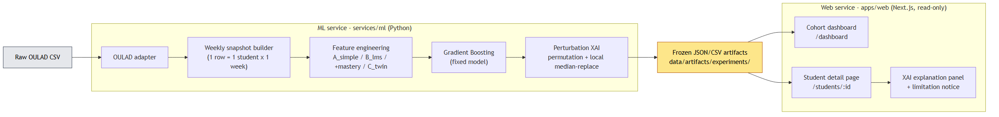
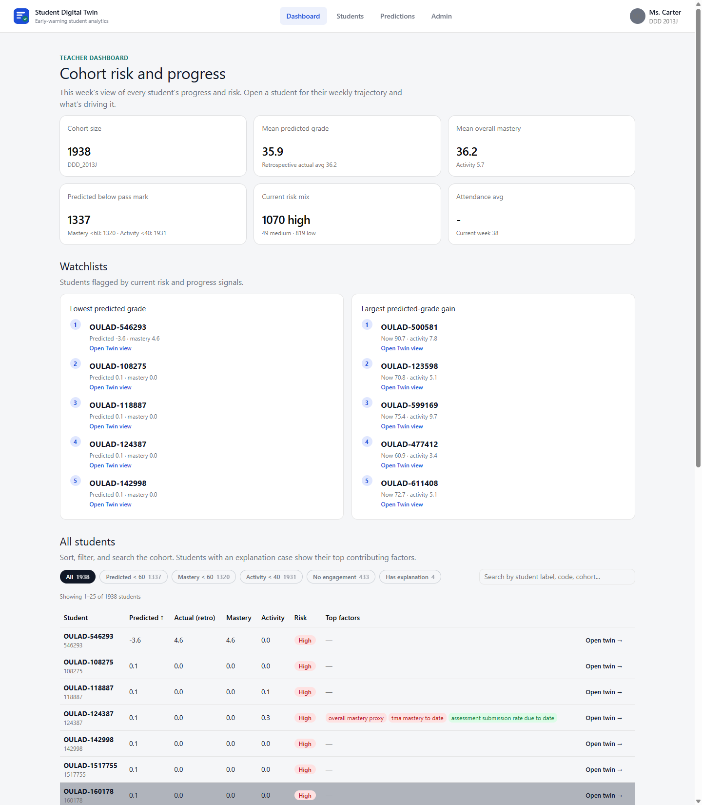
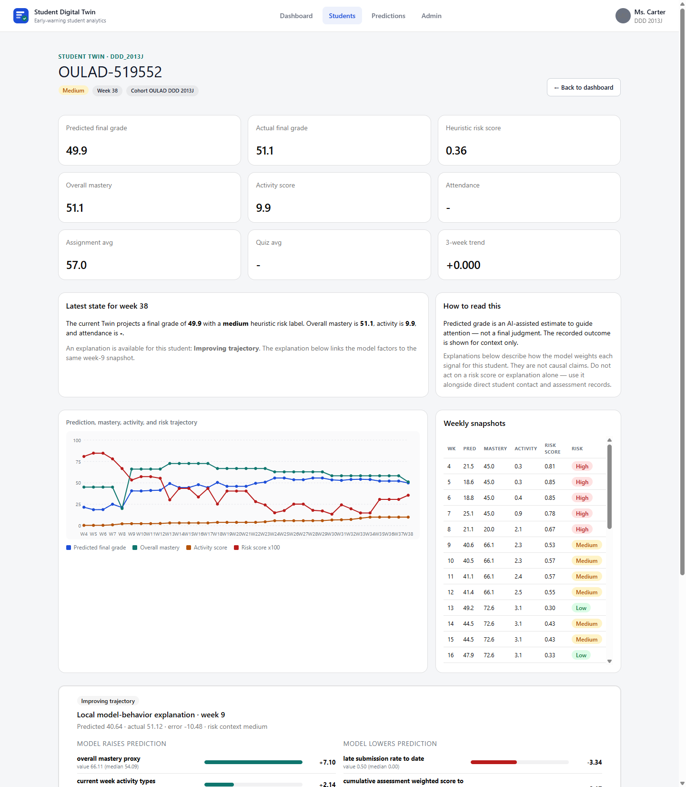
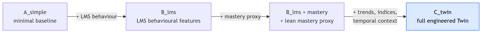
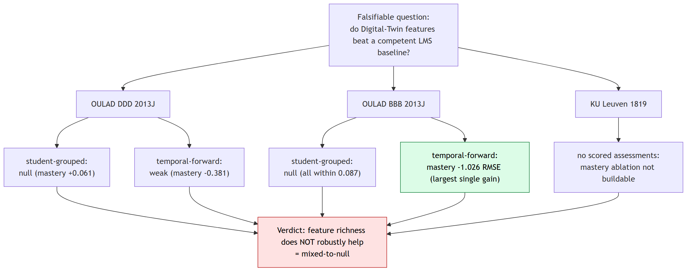
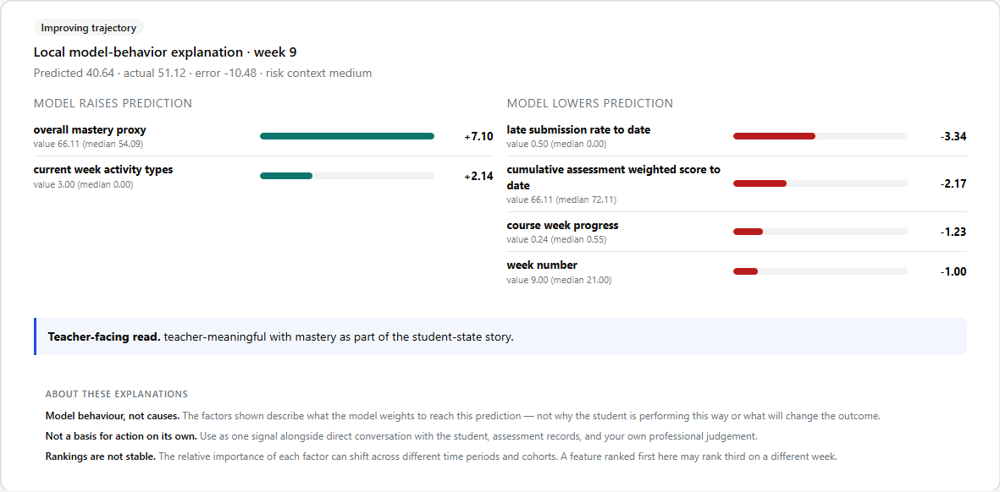
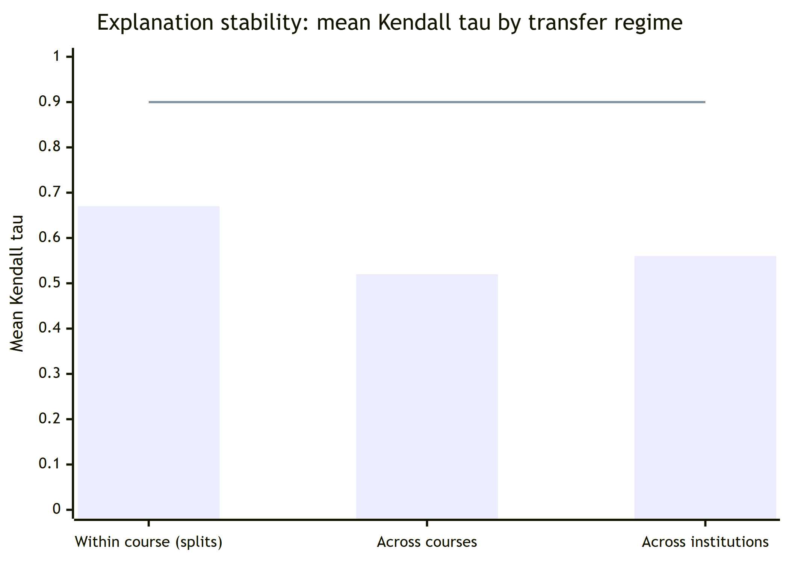

UDC 004.8:37

<!--
Formatting note (remove before submission): this Markdown file follows the
*structure* required by "Auezov University / South Kazakhstan Science Herald"
(Introduction; Materials and Methods; Results and Discussion; Conclusions;
References). Styling is intentionally deferred. Before submission, transfer the
content into the journal's Microsoft Word template: Times New Roman, 12 pt main
text / 11 pt for figures and captions, single line spacing, 1.0 cm first-line
indent, justified, A4 with 2 cm margins on all sides. Author block and ORCIDs
are placeholders — fill in co-authors and affiliations. All quantitative results
are taken verbatim from the frozen experiment artifacts in
`data/artifacts/experiments/` and the dissertation synthesis in
`docs/dissertation/`. Figures are referenced from `docs/dissertation/figures/`.
-->

---

**Title (English):**
DOES FEATURE RICHNESS HELP? A REPRODUCIBLE, HONEST EVALUATION OF A STUDENT DIGITAL TWIN AND ITS EXPLANATION STABILITY ACROSS TWO INSTITUTIONS

**Название (русский):**
ПОМОГАЕТ ЛИ БОГАТСТВО ПРИЗНАКОВ? ВОСПРОИЗВОДИМАЯ И ЧЕСТНАЯ ОЦЕНКА ЦИФРОВОГО ДВОЙНИКА СТУДЕНТА И УСТОЙЧИВОСТИ ЕГО ОБЪЯСНЕНИЙ В ДВУХ УЧРЕЖДЕНИЯХ

**Атауы (қазақша):**
БЕЛГІЛЕРДІҢ МОЛДЫҒЫ КӨМЕКТЕСЕ МЕ? СТУДЕНТТІҢ ЦИФРЛЫҚ ЕГІЗІН ЖӘНЕ ОНЫҢ ТҮСІНДІРМЕЛЕРІНІҢ ЕКІ МЕКЕМЕ БОЙЫНША ТҰРАҚТЫЛЫҒЫН ҚАЙТАЛАНАТЫН ЖӘНЕ АДАЛ БАҒАЛАУ

---

**A. Talgat\***

*Undergraduate Researcher, School of Software Engineering, Astana IT University, Astana, Kazakhstan*

**А. Талгат\***

*Студент-исследователь, Школа программной инженерии, Astana IT University, Астана, Казахстан*

**А. Талғат\***

*Студент-зерттеуші, Бағдарламалық инженерия мектебі, Astana IT University, Астана, Қазақстан*

ORCID: 0000-0000-0000-0000

**[Co-author 2]** — *position, academic degree and title, organization, city, country (in three languages)* — ORCID: 0000-0000-0000-0000

**[Co-author 3]** — *position, academic degree and title, organization, city, country (in three languages)* — ORCID: 0000-0000-0000-0000

\*Corresponding author: A. Talgat, a1byn.talgat05@gmail.com

---

## Abstract

Learning management systems record large volumes of educational activity, but their built-in analytics are mostly descriptive rather than predictive or explanatory. The purpose of this study is to test, rather than assume, whether engineered Student Digital Twin features improve grade prediction over a competent LMS baseline and whether the accompanying explanations are stable enough to show a teacher. The methodology is a dependency-driven sequence of leakage-aware experiments coupling a lean weekly student-state representation with a gradient-boosting predictor and a perturbation-based explainable-AI layer, evaluated through a nested feature ablation on real public data from two institutions. The originality lies in an end-to-end, reproducible, honest multi-cohort evaluation, including a documented synthetic-target circularity failure mode. The results show that adding feature richness does not robustly help: no Twin block beats the baseline by more than 1.0 RMSE on the primary cohort, only one cell shows a real gain, and explanation rankings are regime-sensitive (Kendall τ 0.32–0.79).

**Keywords:** learning analytics; explainable AI; explanation stability; student performance prediction; digital twin; gradient boosting; reproducibility

---

## Аннотация

Системы управления обучением фиксируют большие объёмы учебной активности, однако их встроенная аналитика преимущественно описательна, а не прогнозна или объяснительна. Цель исследования — проверить, а не предполагать, улучшают ли инженерные признаки цифрового двойника студента прогноз оценки по сравнению с компетентной базовой LMS-моделью и достаточно ли устойчивы объяснения, чтобы показывать их преподавателю. Методология — управляемая зависимостями последовательность зафиксированных, защищённых от утечек экспериментов, объединяющая компактное, учитывающее время недельное представление состояния студента с прогнозирующей моделью градиентного бустинга и слоем объяснимого ИИ на основе пертурбаций, оцениваемая через вложенную абляцию признаков на реальных открытых данных двух учреждений. Оригинальность состоит в сквозной, воспроизводимой и честной мультикогортной оценке, включая задокументированный сбой циркулярности синтетической цели. Результаты показывают, что добавление богатства признаков не помогает устойчиво: ни один блок двойника не превосходит базовую модель более чем на 1,0 RMSE на основной когорте, лишь одна межкогортная ячейка даёт реальный прирост, а ранги объяснений зависят от режима (Kendall τ 0,32–0,79).

**Ключевые слова:** учебная аналитика; объяснимый ИИ; устойчивость объяснений; прогнозирование успеваемости; цифровой двойник; градиентный бустинг; воспроизводимость

---

## Түйін

Оқытуды басқару жүйелері оқу әрекетінің үлкен көлемін тіркейді, бірақ олардың кіріктірілген аналитикасы көбіне болжамдық немесе түсіндірмелік емес, сипаттамалық сипатта болады. Зерттеудің мақсаты — студенттің цифрлық егізінің инженерлік белгілері баға болжамын құзыретті базалық LMS моделімен салыстырғанда жақсартатынын және түсіндірмелердің мұғалімге көрсетуге жеткілікті тұрақты екенін болжамай, тексеру. Әдіснама — тәуелділікке негізделген, ағып кетуден қорғалған, бекітілген эксперименттер тізбегі болып табылады; ол студент күйінің ықшам әрі уақытты ескеретін апталық көрінісін градиенттік бустинг болжаушысымен және пертурбацияға негізделген түсіндірілетін ЖИ қабатымен біріктіреді әрі екі мекеменің нақты ашық деректерінде кірістірілген белгілер абляциясы арқылы бағаланады. Жаңалығы — рекордтық дәлдік емес, ұштан-ұшқа, қайталанатын әрі адал көпкогорттық бағалауда, оның ішінде синтетикалық мақсаттың циркулярлық сәтсіздік режимін құжаттауда. Нәтижелер белгілер молдығын қосу тұрақты түрде көмектеспейтінін көрсетеді: бірде-бір егіз блогы негізгі когортта базалық модельден 1,0 RMSE-ден артық озбайды, тек бір когортаралық ұяшық нақты өсім береді, ал түсіндірме рангтары режимге тәуелді (Kendall τ 0,32–0,79).

**Кілт сөздер:** оқу аналитикасы; түсіндірілетін ЖИ; түсіндірмелердің тұрақтылығы; үлгерімді болжау; цифрлық егіз; градиенттік бустинг; қайталанушылық

---

## Introduction

Learning management systems (LMS) capture attendance, submissions, marks, and clickstream activity, yet teachers still lack an integrated, forward-looking view of a student's evolving academic state, the likely end-of-course outcome, and the factors behind that estimate. Most published learning-analytics work optimises a classifier for accuracy on a held-out split and appends post-hoc explanations, reporting only the best configuration on a single cohort. This leaves three practical questions unanswered: whether a *Digital-Twin* representation of student state adds defensible value over a plain LMS feature set, whether the resulting explanations are stable enough to show a teacher, and whether the whole cycle can be implemented and reproduced on real public data.

This paper addresses those questions with a working prototype and an explicitly honest evaluation. The central object is the student modelled as a dynamic digital twin: weekly state snapshots at the grain *1 row = 1 student × 1 week*. The term "Digital Twin" here denotes a lean, time-aware state representation, not a full counterfactual simulation engine. We retain the term deliberately but scope it narrowly: the twin maintains a *descriptive* weekly state and includes a lightweight what-if layer — estimating the predicted-grade change if a flagged factor reached its cohort median — rather than a mechanistic simulation. Full simulation and causal counterfactual reasoning are treated as explicit design boundaries rather than implicit promises. Around this representation we build a gradient-boosting predictor, a perturbation-based explainable-AI (XAI) layer, and a Next.js teacher interface that reads frozen prediction artifacts.

**Literature review.** Training gradient boosting or random forests on the Open University Learning Analytics Dataset (OULAD) and adding SHAP explanations post-hoc is now standard practice [4]–[7]. Published benchmarks reach ROC-AUC 0.993 and F1 0.911 on dropout prediction [4]. Adding explainability is therefore no longer a contribution by itself, and continuous-grade regression — used here alongside classification — is comparatively less common but not sufficient on its own. Tiukhova et al. [2] showed that XAI-derived feature importance for student-success models can be unstable across configurations; we extend this stability lens from the single-model setting to a *transfer* setting, measuring rank agreement across evaluation splits, across two OULAD courses, and across institutions. Digital twins in education appear mostly as conceptual or review work [8]; working implementations of a student digital twin on real data are essentially absent. Teacher-facing interfaces in peer-reviewed work publish model metrics, not systems; commercial platforms (EAB Navigate, Civitas Learning, Brightspace Insights) have dashboards but are closed and undocumented. Papers that add SHAP rarely address how teachers may *misinterpret* explanations or the difference between model-behaviour description and causal claim.

**Research gap and key provisions.** No published work implements and honestly evaluates a full-cycle prototype — raw data → weekly twin snapshots → predictions → per-student explanations → teacher UI — on real public data, with explicit documentation of where the added components fail to beat a simpler baseline. This paper targets that gap. The novelty is not a new algorithm or a higher accuracy number. It is the combination of (1) an end-to-end, open, leakage-aware pipeline from raw OULAD data to teacher-facing weekly explanations; (2) a dependency-driven ablation that tests the Twin representation instead of assuming it; (3) an explanation-stability analysis across splits, courses, and institutions; and (4) an honest multi-cohort finding — including a documented synthetic-data circularity failure mode — of a kind systematically underrepresented in the literature.

## Materials and Methods

### Theoretical analysis: system architecture

The prototype is a monorepo with two independently runnable services and a strict read-only boundary between computation and presentation.

The **ML service** (`services/ml/`, Python) contains the OULAD data adapter, the weekly snapshot builder, the feature-engineering pipeline, the experiment runner, the model-training code, and the perturbation-based XAI module. All experiment outputs are versioned JSON/CSV artifacts under `data/artifacts/experiments/<experiment_id>/`. The **Web service** (`apps/web/`, Next.js) is a server-side-rendered frontend that reads the frozen artifacts at request time and serves teacher-facing views; it performs no ML computation, so results are reproducible independently of the UI and the UI is testable without retraining. The data flow is: raw OULAD CSV → OULAD adapter → weekly snapshot table (one row per student per week) → feature engineering → trained Gradient Boosting model → prediction and perturbation-based explanation artifacts → JSON consumed by the web app.

Figure 1 – End-to-end architecture: raw OULAD CSV → ML service (adapter → weekly snapshots → feature engineering → Gradient Boosting → XAI) → frozen JSON artifacts → read-only Next.js teacher interface.

The teacher interface comprises a *cohort dashboard* — a sortable, filterable table of all students with predicted grade, pass-risk badge, current week, and key LMS signals — and a *student detail page* with summary cards (predicted vs. actual grade, risk, mastery, activity, attendance, assignment/quiz averages, 3-week trend), a weekly trajectory chart, a raw weekly-snapshot table, an explanation panel listing which signals raise or lower the current-week prediction, and a *what-if panel* showing the estimated predicted-grade gain if each flagged below-median factor reached its cohort median. The explanation panel carries an explicit XAI limitation notice: the factors describe *model behaviour, not causes*; the score is not a sole basis for intervention; and rankings can shift across time periods and cohorts. We present the interface as a *design demonstrator* whose presentation of XAI output is derived from the explanation-stability result, not as an evaluated intervention; no user study is claimed here.

Figure 2 – Teacher cohort dashboard: a sortable, filterable table of all students with predicted final grade, pass-risk badge (high / medium / low), current week, and key LMS signals, supporting one-click filtering to the high-risk group.

Figure 3 – Per-student view: summary cards (predicted vs. actual grade, risk, mastery, activity, attendance, assignment/quiz averages, 3-week trend), the weekly trajectory chart, and the raw weekly-snapshot table.

### Datasets

We evaluate on real, public, non-circular data from two institutions:

- **OULAD DDD 2013J** [1]: 1,938 students, 67,830 weekly snapshots, weeks 4–38.
- **OULAD BBB 2013J** [1]: 2,237 students, 80,532 weekly snapshots; richer dated assessment structure than DDD.
- **KU Leuven 1819** [3]: 1,495 students, two courses pooled, weeks 2–15.

A separate **synthetic** dataset is used only for controlled methodological checks; its limitations are stated in the Results and Discussion section.

### Feature sets (nested ablation)

The Digital-Twin representation is tested by decomposition, not assumed. Each set is a strict superset of the previous one (A_simple ⊂ B_lms ⊂ B_lms+mastery ⊂ C_twin):

- **A_simple** — minimal baseline.
- **B_lms** — LMS behavioural features (the proxy for "what the literature uses").
- **B_lms + mastery** — LMS plus a lean mastery-proxy block derived from the dated assessment structure.
- **C_twin** — full engineered Twin representation (trends, mastery, indices, temporal context).

Figure 4 – Nested feature-set ablation. Each set is a strict superset of the previous one, so the Digital-Twin representation is tested by decomposition rather than assumed.

### Experimental part: models and protocol

Model families are deliberately simple and defensible: Ridge regression, Logistic Regression, Random Forest, and Gradient Boosting. Two splits are used: a **student-grouped** split (primary; `test_size = 0.25`, `seed = 42`; for DDD: 1,454 train vs. 484 test students) and a **temporal-forward** split (train on early weeks, predict later weeks). The pipeline is leakage-aware: train-only preprocessing, explicit forbidden-column enforcement, and **fixed-model** reporting (Gradient Boosting held fixed across splits) to neutralise best-model-per-cell selection artifacts. Targets are `final_weighted_score` (regression, 0–100) and `passed_observed` (binary classification). All abbreviations follow first use: LMS — learning management system; XAI — explainable artificial intelligence; OULAD — Open University Learning Analytics Dataset; RMSE — root mean squared error; ROC-AUC — area under the receiver-operating-characteristic curve.

## Results and Discussion

### This work vs. standard baselines

All rows in Table 1 use OULAD DDD 2013J, the `B_lms` feature set, and the student-grouped split, except the last "ours" row which adds the mastery block. RMSE is on the 0–100 score scale; F1/ROC-AUC are for `passed_observed`.

Table 1 – This work versus standard baselines on OULAD DDD 2013J

| Approach | RMSE | F1 | ROC-AUC | Per-student XAI | Teacher UI | Open |
|---|---|---|---|---|---|---|
| Logistic Regression (ours) | — | 0.854 | 0.951 | No | No | Yes |
| Random Forest (ours) | 13.633 | 0.861 | 0.947 | No | No | Yes |
| GB LMS-only (ours) | 12.658 | 0.863 | 0.953 | No | No | Yes |
| **GB + Twin + XAI (this work)** | **12.724** | **0.861** | **0.953** | **Yes** | **Yes** | **Yes** |
| GB + SHAP (literature) [4] | — | 0.911 | 0.993 | Yes | No | Partial |
| Commercial (EAB Navigate) | unknown | unknown | unknown | Partial | Yes | No |

Gradient Boosting on `B_lms` is the strongest baseline (RMSE 12.658, F1 0.863, ROC-AUC 0.953); Ridge regression is the weakest (RMSE 14.318). Logistic Regression is already competitive (F1 0.854, ROC-AUC 0.951), reflecting that the dominant predictor — assessment submission rate — is approximately linear in the log-odds of passing. Adding the mastery (Twin) block changes RMSE by **+0.066** (worse) and F1 by **−0.002**: no improvement on this cohort and split. This is the honest negative result, stated rather than hidden.

### When does the Twin help, and when not?

The full nested ablation under fixed-model reporting gives a course- and split-dependent answer (Table 2).

Table 2 – Twin benefit by cohort and split (RMSE deltas vs. `B_lms`; negative = improvement)

| Cohort | Student-grouped | Temporal-forward |
|---|---|---|
| DDD 2013J | null (mastery +0.061) | weak: mastery −0.381 |
| BBB 2013J | null (all within 0.087) | **largest gain: mastery −1.026** |

On DDD, no Twin block beats `B_lms` by more than 1.0 RMSE on either split, the full `C_twin` stays within ±0.025 RMSE (non-inferior, not better), and the minimal `A_simple` is clearly worse (+1.207 grouped, +4.105 temporal-forward) — confirming the LMS layer already carries the signal. On BBB, which has a richer assessment structure, the mastery block improves the temporal-forward split by −1.026 RMSE (6.311 → 5.284) and the full `C_twin` by −0.765, but the student-grouped split stays null and the trend/index blocks are null on both courses.

Engineered Twin value is therefore *heterogeneous*: it appears only under forward-time prediction on a course with rich assessment structure, and disappears under the student-grouped regime. We verified that the direction of the single positive cell is robust: a student-clustered bootstrap (5,000 resamples of the 559 held-out test students, seed = 42) was run by re-executing the frozen pipeline. Because gradient boosting is environment-sensitive, reproduced point estimates differ from the stored ones (reproduced delta −2.16 vs. stored −1.03 RMSE); the 95% confidence interval of the mastery RMSE reduction lies entirely below zero ([−2.54, −1.80]; P(delta ≥ 0) = 0.000 across all 5,000 resamples), confirming the direction is not noise. The magnitude is sensitive to the out-of-time extrapolation regime, so we treat this as the one cell where Twin features clearly help, not as a stable effect size. Crucially, the OULAD classification target is genuinely predictive throughout (best-model F1 0.83–0.93, never 1.000), which is what makes this negative finding trustworthy.

Figure 5 – Dependency-driven evaluation arc and its honest verdict: only the BBB temporal-forward cell shows a real mastery gain (−1.026 RMSE); everything else is null or weak, so the overall finding is mixed-to-null.

### XAI and explanation stability

Explanations use held-out **permutation importance**, model-native importance, and one-feature **local median-replacement** perturbation. We deliberately avoid SHAP: Shapley-value attributions rest on a background / conditional-expectation estimate that is fragile on the small per-student samples surfaced in the teacher UI, and have documented conceptual and robustness problems as feature-importance measures [12], [13]; the perturbation method instead operates directly on the single prediction row shown to the teacher, with no background-set assumption. On DDD, the dominant factor is `assessment_submission_rate_due_to_date` (importance share 0.28–0.38; 0.381 in the headline model) and, once mastery is included, the co-circular `overall_mastery_proxy` (0.23–0.43). The genuinely exogenous signals — `is_unregistered_by_week` (0.13–0.20) and VLE clickstream (0.02–0.06) — are interpretable but carry modest weight (Table 3).

Table 3 – Top global importance shares (DDD 2013J, fixed model)

| Feature set | Rank | Feature | Importance share |
|---|---|---|---|
| B_lms | 1 | activity_score_to_date | 0.701 |
| B_lms | 2 | avg_assignment_score_to_date | 0.145 |
| B_lms | 3 | avg_quiz_score_to_date | 0.086 |
| B_lms + mastery | 1 | activity_score_to_date | 0.648 |
| B_lms + mastery | 2 | overall_mastery | 0.178 |
| B_lms + mastery | 3 | avg_assignment_score_to_date | 0.090 |

Figure 6 – Per-student model-behaviour explanation: signals that raise vs. lower the current-week prediction, a teacher-readable summary sentence, and the explicit XAI limitation notice (model behaviour, not causes; not a sole basis for intervention; rankings shift across regimes).

The rankings are **not invariant**. Within a course, across splits, Kendall τ = 0.79 / 0.68 / 0.55 for `B_lms` / `+mastery` / `C_twin` (mean 0.67); none reach 0.90. Across courses (DDD vs. BBB), τ = 0.32–0.61 (mean 0.52) — even less stable. Across three institutions (engagement-only), mean τ ≈ 0.56; clicks and active-days recur as top drivers, but the mid/lower ordering is institution-specific (Figure 7).

Figure 7 – Explanation-stability summary. Mean Kendall τ of permutation-importance rankings falls as the evaluation regime moves further from training and never reaches the τ = 0.90 stability threshold. Explanations must therefore be framed as model behaviour under a particular evaluation scenario, not as stable causal rankings.

A controlled synthetic faithfulness probe confirms the method is faithful when ground truth is known: at the final course week, permutation importance recovers the generator's weight *ordering* exactly (Kendall τ = 1.0). The same few features dominate across regimes, but their relative priority reorders.

### Second institution

KU Leuven exposes clickstream and course structure but **no intermediate scored assessments and no continuous grade** — only a binary `PASSED` outcome. The mastery/Twin ablation therefore cannot be built there at all (itself a cross-institution heterogeneity result). On its engagement-only task, prediction is modest (F1 0.75–0.76, ROC-AUC 0.65–0.72) and a richer engagement set does not beat a minimal two-feature one (fixed-model F1 delta −0.015 / +0.000). A matched three-institution synthesis confirms a two-feature engagement baseline (clicks + active-days) is hard to beat (F1 delta spread −0.016 to +0.026).

### Discussion

Three points follow. First, on the **central question** — do Twin features beat a competent LMS baseline? — the honest answer across three real cohorts and two institutions is *not robustly*. The benefit is real but narrow (BBB, temporal-forward, mastery) and vanishes under the stricter student-grouped regime, on other courses, and on other blocks. Reporting only the favourable cell, as is common, would have manufactured a false "Twin wins" narrative.

Second, **explanations are regime-dependent**. Importance rankings reorder across splits, courses, and institutions, which has a direct product consequence: a teacher UI must present XAI output as "how the model weights each signal for this prediction", not "why this student is at risk". Our interface encodes exactly this caveat.

Third, the contribution is best read on **three axes**, not accuracy alone. On accuracy this work is comparable to standard baselines and below the published best (ROC-AUC 0.953 vs. 0.993 [4]) — expected and not a weakness. On explainability it provides per-student, background-free perturbation explanations with documented stability limits. On teacher-facing completeness it is, to our knowledge, the most complete openly-documented artifact of its kind.

**Limitations and threats to validity.** During development, a synthetic target manufactured an apparent "mastery win": the synthetic `final_grade` is a deterministic, noise-free closed-form weighted mean of the same behaviours the features re-aggregate (week-10 reconstruction error 0.008, correlation 1.000000), so the resulting R² ≈ 0.99 and saturated `passed` F1 = 1.000 are algebraic artifacts, not learnable signal. We report this explicitly as a cautionary methodological result. On OULAD, `final_weighted_score` is partly fed by assessment scores, so the regression results lean somewhat on within-system accounting; the classification target and VLE clickstream are the cleaner, exogenous evidence. `overall_mastery` is close to cumulative LMS performance (|r| = 0.993 with `avg_assignment_score`), so it must not be presented as an independent construct. The teacher interface is a design demonstrator with no user evaluation. Evidence spans two OULAD courses (one institution) and a second institution that cannot test the mastery ablation; explanations are not causal and not SHAP. The what-if layer is a descriptive, perturbation-based estimate, not a mechanistic simulation or causal claim.

## Conclusions

We presented an explainable, teacher-facing Student Digital Twin and evaluated it honestly across two institutions. On real, non-circular OULAD data the engineered Twin features do not deliver a consistent advantage over a competent LMS baseline: the result is mixed-to-null on DDD 2013J and heterogeneous on BBB 2013J (mastery −1.026 RMSE on temporal-forward only), and a second institution cannot even build the ablation. The accompanying XAI explanations are regime-sensitive within a course (Kendall τ 0.55–0.79) and partly course-specific across courses (0.32–0.61). The contribution is therefore methodological and system-level — a reproducible, leakage-aware pipeline with a teacher interface, an explanation-stability analysis, a documented synthetic-circularity failure mode, and an honest multi-cohort finding — rather than an accuracy record. As practical recommendations, teacher-facing dashboards should present XAI output as model behaviour under a stated evaluation scenario and should not assume that richer engineered features improve prediction without per-cohort verification. Future work includes external validation across more institutions and validated intervention/counterfactual reasoning.

## Acknowledgements

This research received no external funding. The authors thank the providers of the public datasets used. All datasets are public and openly licensed: OULAD is distributed under CC-BY 4.0 [1]; the KU Leuven activity/performance dataset is distributed under CC-BY 4.0 via Zenodo [3]. The authors are not affiliated with, and report no competing interest in, the dataset providers. All experiment code, configuration, and frozen result artifacts (versioned JSON/CSV per experiment) are available in the project repository at [repository URL] to support independent reproduction.

## References

[1] J. Kuzilek, M. Hlosta, and Z. Zdrahal, "Open University Learning Analytics dataset," Scientific Data, vol. 4, art. 170171, 2017, doi: 10.1038/sdata.2017.171.

[2] E. Tiukhova, P. Vemuri, N. López Flores, A. S. Islind, M. Óskarsdóttir, S. Poelmans, B. Baesens, and M. Snoeck, "Explainable Learning Analytics: Assessing the stability of student success prediction models by means of explainable AI," Decision Support Systems, vol. 182, art. 114229, 2024, doi: 10.1016/j.dss.2024.114229.

[3] E. Tiukhova, D. Van Landuyt, B. Baesens, and M. Snoeck, "Open data, private learners: a de-identified student activity and performance dataset for learning analytics," Scientific Data, 2026, Zenodo, doi: 10.5281/zenodo.17087849.

[4] J. López de la Rosa et al., "A Modular and Explainable Machine Learning Pipeline for Student Dropout Prediction in Higher Education," Algorithms, vol. 18, no. 10, art. 662, 2025, doi: 10.3390/a18100662.

[5] "Predicting student performance: A comprehensive review of machine learning, deep learning, and explainable AI approaches," Computers and Education: Artificial Intelligence, 2026. doi: 10.1016/j.caeai.2026.100396.

[6] "An explainable AI-based approach for predicting undergraduate students' academic performance," Computers and Education: Artificial Intelligence, 2025. doi: 10.1016/j.caeai.2025.100376.

[7] "Machine learning models for academic performance prediction: interpretability and application in educational decision-making," Frontiers in Education, vol. 10, art. 1632315, 2025, doi: 10.3389/feduc.2025.1632315.

[8] "Digital Twins and Artificial Intelligence as Pillars of Personalized Learning Models," Communications of the ACM, vol. 65, no. 4, 2022, doi: 10.1145/3478281.

[9] S. M. Lundberg and S.-I. Lee, "A unified approach to interpreting model predictions," in Advances in Neural Information Processing Systems (NeurIPS), 2017, pp. 4765–4774.

[10] L. Breiman, "Random forests," Machine Learning, vol. 45, no. 1, pp. 5–32, 2001, doi: 10.1023/A:1010933404324.

[11] J. H. Friedman, "Greedy function approximation: a gradient boosting machine," Annals of Statistics, vol. 29, no. 5, pp. 1189–1232, 2001.

[12] I. E. Kumar, S. Venkatasubramanian, C. Scheidegger, and S. Friedler, "Problems with Shapley-value-based explanations as feature importance measures," in Proc. 37th Int. Conf. Machine Learning (ICML), 2020, pp. 5491–5500.

[13] D. Slack, S. Hilgard, E. Jia, S. Singh, and H. Lakkaraju, "Fooling LIME and SHAP: Adversarial attacks on post hoc explanation methods," in Proc. AAAI/ACM Conf. AI, Ethics, and Society (AIES), 2020, pp. 180–186.

<!--
References note: the article is written in English; per the journal rules a
transliterated (Latin-script) reference list is required only for Kazakh- or
Russian-language articles. All references above are already in Latin script, so
no separate transliterated list is needed. 13 references provided (minimum is 7);
the large majority were published within the last 10–15 years, satisfying the
≥70% recency requirement.
-->

---

## Author details (in two languages other than the language of the article)

Per the journal requirement, the following block provides — in Russian and Kazakh — full author details plus the article title, abstract, and keywords. (The English versions appear at the top of the article.)

### На русском языке

**Талгат А.** — студент-исследователь, Школа программной инженерии, Astana IT University, Астана, Казахстан. E-mail: a1byn.talgat05@gmail.com

**Название статьи:** Помогает ли богатство признаков? Воспроизводимая и честная оценка цифрового двойника студента и устойчивости его объяснений в двух учреждениях.

**Аннотация:** (см. раздел «Аннотация» выше — идентичный текст, 100–150 слов.)

**Ключевые слова:** учебная аналитика; объяснимый ИИ; устойчивость объяснений; прогнозирование успеваемости; цифровой двойник; градиентный бустинг; воспроизводимость.

### Қазақ тілінде

**Талғат А.** — студент-зерттеуші, Бағдарламалық инженерия мектебі, Astana IT University, Астана, Қазақстан. E-mail: a1byn.talgat05@gmail.com

**Мақаланың атауы:** Белгілердің молдығы көмектесе ме? Студенттің цифрлық егізін және оның түсіндірмелерінің екі мекеме бойынша тұрақтылығын қайталанатын және адал бағалау.

**Түйіндеме:** (жоғарыдағы «Түйін» бөлімін қараңыз — мәтіні бірдей, 100–150 сөз.)

**Кілт сөздер:** оқу аналитикасы; түсіндірілетін ЖИ; түсіндірмелердің тұрақтылығы; үлгерімді болжау; цифрлық егіз; градиенттік бустинг; қайталанушылық.
