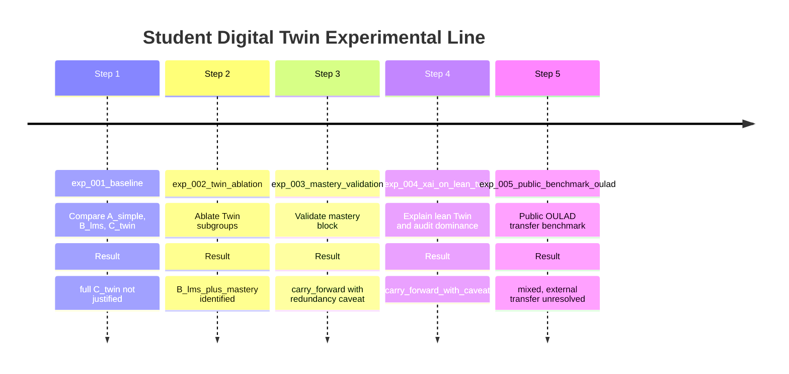

# Executive Summary

In this dissertation phase, I investigated whether a Digital Twin-inspired representation of a student adds predictive and explanatory value beyond a competent LMS-style baseline in a controlled, synthetic educational analytics environment, then stress-tested the carry-forward representation on OULAD as a public external benchmark. The experimental program was intentionally conservative. I began with standard tabular baseline models, introduced richer feature representations only under explicit hypotheses, validated the remaining Twin signal after ablation, added explainability only after the candidate representation had passed predictive and structural checks, and treated the OULAD phase as transfer validation rather than dataset competition.

The main outcome is not a claim of full Digital Twin superiority. Instead, the evidence supports a narrower and more defensible conclusion. The full Twin representation (`C_twin`) was not justified under the present setup: it failed to outperform the stronger LMS baseline (`B_lms`) on the primary student-grouped split and degraded more clearly under the stricter temporal-forward split. The subsequent ablation showed that the useful signal of the Twin layer was concentrated mainly in the mastery block. In particular, `B_lms_plus_mastery` reduced RMSE from `2.101` to `1.894` on the primary student-grouped split, while the full Twin remained worse than the LMS baseline. The mastery block was then validated through correlation analysis, redundancy analysis, week-wise evaluation, and drop-column diagnostics. Finally, the lean candidate was explained using permutation importance and local perturbation-based explanations.

The principal caveat concerns `overall_mastery`. It is operationally legitimate in the current pipeline: it is computed only from submission information available up to the snapshot week, and it does not read end-of-course targets. However, it is also highly redundant with LMS aggregates, especially `avg_assignment_score_to_date` (`|r| = 0.993`). Removing `overall_mastery` from the lean Twin raises RMSE by `+0.228`, which confirms that a substantial part of the improvement is concentrated in this single feature. The XAI phase nevertheless showed that the model did not collapse completely onto one variable. Under gradient boosting on the primary split, `activity_score_to_date` ranked first by global permutation importance share (`0.648`), `overall_mastery` ranked second (`0.178`), and the average local mastery contribution share was `0.194`, below the configured warning threshold.

The OULAD benchmark complicates external transfer. On OULAD `DDD` `2013J`, `B_lms_plus_mastery_oulad` did not improve the primary student-grouped split (RMSE `12.724` versus `12.658`, delta `+0.066`), but it did improve the secondary temporal-forward split (RMSE `9.161` versus `9.566`, delta `-0.406`). This mixed result keeps the lean mastery logic plausible but unresolved externally.

I therefore carry forward a bounded conclusion: within the current synthetic and schema-controlled environment, a **lean Twin representation** centered on mastery (`B_lms_plus_mastery`) provides measurable predictive value beyond a stronger LMS baseline on the primary split and remains interpretable under a documented XAI procedure. The dissertation should present this contribution as a **teacher-oriented lean Twin + XAI research prototype** with an initial OULAD transfer caveat, not as proof that the full Digital Twin formulation is superior in general, and not as an externally validated institutional model.  
Primary repository artifacts for the headline results are:  

- `data/artifacts/experiments/exp_001_baseline/baseline_v1_results.json`  
- `data/artifacts/experiments/exp_002_twin_ablation/exp_002_twin_ablation_results.json`  
- `data/artifacts/experiments/exp_003_mastery_validation/exp_003_mastery_validation_results.json`  
- `data/artifacts/experiments/exp_004_xai_on_lean_twin/exp_004_xai_on_lean_twin_results.json`
- `data/artifacts/experiments/exp_005_public_benchmark_oulad/exp_005_public_benchmark_oulad_results.json`

## Methodological Justification of Model and Experiment Design

### Research framing

The project addresses a representation question rather than a pure model-tuning question. I did not ask whether a single opaque model could fit the synthetic dataset; under the current generator, several models can fit it well. I asked whether an engineered student-state representation—framed as a Digital Twin—carries predictive information beyond LMS-like aggregates, and whether the resulting model behavior remains interpretable enough for teacher-facing use. This emphasis on representation choice, leakage-aware evaluation, and cautious explanation is consistent with dissertation practice in educational data mining and tabular ML [REF_1; REF_2; REF_3].

### Why these ML models

I selected a small, controlled model stack spanning interpretability and nonlinearity:

| Config name           | Actual implementation                                  | Task           | Role in the design                             | Notes                                                                                                                              |
| --------------------- | ------------------------------------------------------ | -------------- | ---------------------------------------------- | ---------------------------------------------------------------------------------------------------------------------------------- |
| `linear_regression`   | Ridge regression                                       | regression     | transparent linear baseline under collinearity | The repository uses the label `linear_regression`, but the implemented estimator is Ridge; I preserve that distinction explicitly. |
| `logistic_regression` | Logistic Regression                                    | classification | transparent binary baseline                    | Used to establish whether the `passed` task is intrinsically easy before relying on nonlinear classifiers.                         |
| `random_forest`       | RandomForestRegressor / RandomForestClassifier         | both           | nonlinear ensemble baseline                    | Appropriate for tabular data with interactions and minimal preprocessing burden.                                                   |
| `gradient_boosting`   | GradientBoostingRegressor / GradientBoostingClassifier | both           | strong tabular reference model                 | Became the reference regression model for the lean Twin XAI phase.                                                                 |

This stack is methodologically appropriate for tabular educational prediction because it allows me to attribute changes in performance primarily to the **feature representation**, not to an exotic model class [REF_1; REF_4]. The linear / logistic models anchor interpretability. Random forest and gradient boosting provide nonlinear baselines and a plausible predictive ceiling for medium-sized tabular problems.

### Why these targets

I used the following target hierarchy:

| Target        | Status                                     | Rationale                                                                                                                                                                                        |
| ------------- | ------------------------------------------ | ------------------------------------------------------------------------------------------------------------------------------------------------------------------------------------------------ |
| `final_grade` | primary supervised target                  | Preserves continuous information and is therefore the most informative benchmark for testing representational value.                                                                             |
| `passed`      | secondary supervised target / context only | Useful operationally, but too coarse to drive feature-set selection once the task saturates.                                                                                                     |
| `risk_level`  | excluded from supervised training          | It is a teacher-facing heuristic derived from snapshot features; predicting it would amount to learning a rule system over the same inputs rather than predicting an external empirical outcome. |

I treated `final_grade` as primary because a continuous grade preserves ordering and magnitude. In contrast, `passed` collapses those distinctions into a threshold label. This matters in a teacher-oriented setting: mildly at-risk and severely at-risk students are not equivalent. The experiments also showed that `passed` saturates under the current generator, making it unsuitable as the central benchmark.

The exclusion of `risk_level` is methodological, not cosmetic. Because it is derived from a heuristic risk score that itself depends on snapshot features, using it as the supervised target would create a circular task. I therefore kept it outside the supervised label space.

### Why these feature sets

The feature hierarchy was nested and hypothesis-driven:

| Feature set | Purpose                          | Core contents                                                             |
| ----------- | -------------------------------- | ------------------------------------------------------------------------- |
| `A_simple`  | minimal academic baseline        | assignment average, quiz average, attendance, plus missingness indicators |
| `B_lms`     | stronger LMS analytics baseline  | `A_simple` + activity, time on platform, submission discipline, attempts  |
| `C_twin`    | full Digital Twin representation | `B_lms` + trends, mastery, composite indices, temporal context            |

The full Twin representation was decomposed further in the ablation step:

| Ablation set                | Added beyond `B_lms`                        |
| --------------------------- | ------------------------------------------- |
| `B_lms_plus_trends`         | score/activity/attendance trends            |
| `B_lms_plus_mastery`        | `current_topic_mastery`, `overall_mastery`  |
| `B_lms_plus_indices`        | engagement, performance, discipline indices |
| `B_lms_plus_temporal`       | week context                                |
| `B_lms_plus_trends_mastery` | trends + mastery                            |
| `C_twin_full`               | full Twin upper reference                   |

This design was necessary because the central question was representational. `A_simple → B_lms → C_twin` made the baseline comparison meaningful. Once the full Twin failed to outperform `B_lms`, the logically correct next step was not to add more models, but to **ablate the Twin layer into meaningful subgroups** [REF_2]. That procedure revealed whether the Twin concept contained a useful core signal or whether it was simply redundant in aggregate form.

### Why these split strategies

I rejected row-random splitting because the modeling unit is `1 student × 1 week`. A row-random split would place multiple snapshots of the same student on both sides of the train/test boundary and would therefore permit identity leakage and week-forward leakage.

The experiment line used two leakage-aware strategies:

| Split strategy     | Purpose                  | Configuration                                                                                                               | Why it matters                                                                                                                                            |
| ------------------ | ------------------------ | --------------------------------------------------------------------------------------------------------------------------- | --------------------------------------------------------------------------------------------------------------------------------------------------------- |
| `student_group`    | primary evaluation split | `test_size = 0.25`, `seed = 42`                                                                                             | Prevents snapshots from the same student appearing in both train and test. This is the primary estimate of generalization to unseen students.             |
| `temporal_forward` | stricter secondary split | train on early weeks, test on later weeks for held-out students; `train_weeks = 6`, `student_test_size = 0.25`, `seed = 42` | Addresses both temporal leakage and identity leakage. This is the closest approximation to an early-warning deployment scenario under the current design. |

The asymmetry between these splits is itself informative. A representation that performs well only under `student_group` but degrades under `temporal_forward` likely contains structure that is less transferable to forward-looking use.

### Why this evaluation protocol and these metrics

The evaluation protocol is multi-metric and task-aligned:

| Task           | Metrics                                  | Why used                                                                                                                                                                              |
| -------------- | ---------------------------------------- | ------------------------------------------------------------------------------------------------------------------------------------------------------------------------------------- |
| Regression     | MAE, RMSE, `R^2`                         | MAE captures average absolute error; RMSE penalizes larger misses and remains interpretable in grade units; `R^2` summarizes explained variance. RMSE is the primary headline metric. |
| Classification | accuracy, precision, recall, F1, ROC-AUC | These cover threshold-based and threshold-independent behavior and are standard in educational prediction reporting [REF_1; REF_5].                                                   |

I retained full metric reporting in the pipeline even though the classification task became uninformative in practice. The synthesis documents emphasize F1 saturation because that is the decisive fact for representation choice under the current generator. Where the repository does not tabulate all classification metrics in the dissertation-oriented summaries, I treat that as an explicit sign that classification was not discriminating enough to shape the interpretation.

### Preprocessing and leakage controls

The experimental pipeline used the following common controls:

| Step                   | Treatment                                                                                                                  |
| ---------------------- | -------------------------------------------------------------------------------------------------------------------------- |
| dataset join           | snapshots from `data/processed/student_twin_snapshots.csv` joined with outcomes from `data/raw/final_results.csv`          |
| week filter            | `min_week = 4`, effectively evaluating weeks `4..10`                                                                       |
| completion filter      | completed-only rows retained for supervised modeling                                                                       |
| imputation             | median imputation fitted on training data only                                                                             |
| missingness indicators | explicit indicators retained and additional `*_was_missing` indicators added where appropriate                             |
| scaling                | only for linear/logistic pipelines                                                                                         |
| forbidden columns      | identifiers, targets-as-features, `risk_score`, `risk_level`, `predicted_final_grade`, and generation-only fields excluded |

These controls are essential to the internal validity of the study. The lineage of mastery features was additionally reviewed to ensure they do not incorporate future or end-of-course information.

### Why synthetic but schema-controlled data was acceptable

I used synthetic rather than institutional data because the project is a methodological research prototype, not a deployment study. The synthetic setting made it possible to enforce a versioned schema (`v1.2`), control leakage, formalize data contracts, and interrogate whether specific Twin components add value. This supports internal methodological validity and reproducibility. It does **not** establish external validity [REF_6]. I therefore interpret all quantitative findings as statements about the controlled environment generated by `generator_v1_3_refined.yaml`, not as claims about a real institutional cohort.

## Experimental Program and Results

### Overall program structure

### Cross-experiment summary

| Experiment                   | Objective                                                       | Main comparison                   | Primary split               | Key result                                         | Consequence                         |
| ---------------------------- | --------------------------------------------------------------- | --------------------------------- | --------------------------- | -------------------------------------------------- | ----------------------------------- |
| `exp_001_baseline`           | test whether full Twin improves over LMS baseline               | `A_simple` vs `B_lms` vs `C_twin` | `student_group`             | `B_lms` outperformed `C_twin`                      | ablate Twin                         |
| `exp_002_twin_ablation`      | identify useful Twin subgroups                                  | `B_lms` vs Twin blocks            | `student_group`             | `B_lms_plus_mastery` best lean extension           | validate mastery                    |
| `exp_003_mastery_validation` | test whether mastery is genuine signal rather than target proxy | `B_lms` vs `B_lms_plus_mastery`   | `student_group` + week-wise | mastery improves early weeks but is redundant      | proceed to XAI with caveat          |
| `exp_004_xai_on_lean_twin`   | explain lean Twin and audit single-feature dominance            | `B_lms` vs `B_lms_plus_mastery`   | `student_group`             | explanations teacher-meaningful; no total collapse | carry forward lean Twin with caveat |
| `exp_005_public_benchmark_oulad` | stress-test lean representation logic on OULAD              | `B_lms_oulad` vs `B_lms_plus_mastery_oulad` | `student_group` | primary split slightly worse, temporal-forward improved | external transfer remains unresolved |

### Experiment 1: `exp_001_baseline`

**Objective.**  
To establish a reproducible baseline and test whether the full Digital Twin representation improved end-of-course prediction beyond a stronger LMS baseline.

**Setup.**  

- Models: Ridge/linear baseline, random forest, gradient boosting for regression; logistic regression, random forest, gradient boosting for classification.  
- Feature sets: `A_simple`, `B_lms`, `C_twin`.  
- Splits: `student_group` and `temporal_forward`.  
- Targets: `final_grade` primary, `passed` secondary, `risk_level` excluded.  
- Numeric sources: `data/artifacts/experiments/exp_001_baseline/baseline_v1_results.json`, `baseline_v1_results.csv`.

**Key quantitative results.**

| Split              | Feature set | Best RMSE | Best model                |
| ------------------ | ----------- | --------- | ------------------------- |
| `student_group`    | `A_simple`  | 2.673     | gradient_boosting         |
| `student_group`    | `B_lms`     | 2.101     | gradient_boosting         |
| `student_group`    | `C_twin`    | 2.149     | random_forest             |
| `temporal_forward` | `A_simple`  | 2.210     | linear_regression (Ridge) |
| `temporal_forward` | `B_lms`     | 2.270     | linear_regression (Ridge) |
| `temporal_forward` | `C_twin`    | 2.937     | linear_regression (Ridge) |

**Classification result.**  
`passed` reached F1 = `1.000` across feature sets and splits. The synthesis documents do not report a meaningful separation in the remaining classification metrics, so I treat the task as saturated and non-discriminating for representation choice.

**Interpretation.**  
The full Twin hypothesis was **not supported**. `C_twin` did not outperform `B_lms` and degraded substantially under the stricter forward split. This negative result directly motivated the ablation study.

### Experiment 2: `exp_002_twin_ablation`

**Objective.**  
To identify which Twin subgroups, if any, added value beyond the strong LMS baseline.

**Setup.**  

- Same model stack, targets, seed, week filter, and splits as `exp_001` to preserve comparability.  
- Feature sets: `B_lms`, `B_lms_plus_trends`, `B_lms_plus_mastery`, `B_lms_plus_indices`, `B_lms_plus_temporal`, `B_lms_plus_trends_mastery`, `C_twin_full`.  
- Numeric sources: `data/artifacts/experiments/exp_002_twin_ablation/exp_002_twin_ablation_results.json`, `exp_002_twin_ablation_results.csv`, `lean_twin_recommendation.md`.

**Primary split results (`student_group`).**

| Feature set                 | Best RMSE | Delta vs `B_lms` |
| --------------------------- | --------- | ---------------- |
| `B_lms_plus_mastery`        | 1.894     | -0.206           |
| `B_lms_plus_trends_mastery` | 1.973     | -0.127           |
| `B_lms_plus_indices`        | 2.035     | -0.066           |
| `B_lms_plus_temporal`       | 2.078     | -0.023           |
| `B_lms_plus_trends`         | 2.096     | -0.005           |
| `B_lms`                     | 2.101     | +0.000           |
| `C_twin_full`               | 2.149     | +0.049           |

**Secondary split summary (`temporal_forward`).**

| Feature set          | Delta vs `B_lms` |
| -------------------- | ---------------- |
| `B_lms_plus_mastery` | +0.006           |
| `B_lms_plus_indices` | -0.068           |
| `C_twin_full`        | +0.667           |

**Interpretation.**  
The useful signal in the full Twin layer was concentrated mainly in the mastery block. The full Twin remained unjustified. I therefore carried forward `B_lms_plus_mastery` as the lean Twin candidate.

### Experiment 3: `exp_003_mastery_validation`

**Objective.**  
To determine whether mastery was a valid Twin-state component or only a near-direct proxy for `final_grade`.

**Setup.**  

- Feature sets: baseline `B_lms`, candidate `B_lms_plus_mastery`, with `B_lms_plus_trends_mastery` and `C_twin_full` retained as context.  
- Splits: `student_group`, `temporal_forward`, and week-wise single-week validation under the grouped split.  
- Improvement criterion for week-wise analysis: `candidate_rmse - baseline_rmse < -0.05`.  
- Numeric sources: `data/artifacts/experiments/exp_003_mastery_validation/exp_003_mastery_validation_results.json`, `mastery_diagnostics.json`, `mastery_weekly_validation.csv`, `mastery_carry_forward_recommendation.md`.

**Headline results.**

| Split              | Feature set                 | Best model                | RMSE  | MAE   | `R^2` | Delta vs `B_lms` |
| ------------------ | --------------------------- | ------------------------- | ----- | ----- | ----- | ---------------- |
| `student_group`    | `B_lms_plus_mastery`        | gradient_boosting         | 1.894 | 1.510 | 0.992 | -0.206           |
| `student_group`    | `B_lms_plus_trends_mastery` | gradient_boosting         | 1.973 | 1.573 | 0.991 | -0.127           |
| `student_group`    | `B_lms`                     | gradient_boosting         | 2.101 | 1.681 | 0.990 | +0.000           |
| `student_group`    | `C_twin_full`               | random_forest             | 2.149 | 1.732 | 0.989 | +0.049           |
| `temporal_forward` | `B_lms`                     | linear_regression (Ridge) | 2.270 | 1.778 | 0.988 | +0.000           |
| `temporal_forward` | `B_lms_plus_mastery`        | linear_regression (Ridge) | 2.276 | 1.776 | 0.988 | +0.006           |
| `temporal_forward` | `B_lms_plus_trends_mastery` | linear_regression (Ridge) | 2.555 | 2.024 | 0.985 | +0.284           |
| `temporal_forward` | `C_twin_full`               | linear_regression (Ridge) | 2.937 | 2.396 | 0.980 | +0.667           |

**Week-wise results.**

| Week | Baseline RMSE (`B_lms`) | Candidate RMSE (`B_lms_plus_mastery`) | Delta RMSE | Improvement? |
| ---- | ----------------------- | ------------------------------------- | ---------- | ------------ |
| 4    | 2.261                   | 2.043                                 | -0.218     | yes          |
| 5    | 3.497                   | 2.906                                 | -0.591     | yes          |
| 6    | 2.311                   | 2.100                                 | -0.210     | yes          |
| 7    | 2.169                   | 2.081                                 | -0.089     | yes          |
| 8    | 1.874                   | 1.489                                 | -0.385     | yes          |
| 9    | 1.179                   | 1.161                                 | -0.019     | no           |
| 10   | 0.404                   | 0.379                                 | -0.025     | no           |

**Interpretation.**  
The mastery block was validated as useful under the primary grouped split and in early-course weeks. However, the weaker result under `temporal_forward` meant that the candidate could not be described as universally dominant. The next step therefore had to audit mastery structure directly rather than move immediately to explanation or deployment claims.

### Experiment 4: `exp_004_xai_on_lean_twin`

**Objective.**  
To explain the lean Twin candidate and determine whether its behavior remained interpretable and teacher-meaningful, or whether it collapsed onto a single mastery variable.

**Setup.**  

- Reference model: `gradient_boosting` regressor.  
- Split: `student_group`.  
- Feature sets: `B_lms` (reference baseline) and `B_lms_plus_mastery` (lean Twin).  
- Explainability methods: held-out permutation importance (`15` repeats, scored with `neg_root_mean_squared_error`) and local one-feature-at-a-time replacement with the training median.  
- Local case archetypes: `strong_performer`, `at_risk`, `improving_trajectory`, `declining_trajectory`, `borderline_medium`.  
- Numeric sources: `data/artifacts/experiments/exp_004_xai_on_lean_twin/exp_004_xai_on_lean_twin_results.json`, `global_feature_importance.csv`, `local_case_explanations.json`, `xai_carry_forward_recommendation.md`.

**Model behavior.**

| Configuration                                  | RMSE  | MAE   | `R^2` |
| ---------------------------------------------- | ----- | ----- | ----- |
| `B_lms`                                        | 2.101 | 1.681 | 0.990 |
| `B_lms_plus_mastery`                           | 1.894 | 1.510 | 0.992 |
| `B_lms_plus_mastery` without `overall_mastery` | 2.122 | 1.686 | 0.990 |

**Global explanation comparison.**

| Feature set          | Rank | Feature                        | Importance share | Direction note                                          |
| -------------------- | ---- | ------------------------------ | ---------------- | ------------------------------------------------------- |
| `B_lms`              | 1    | `activity_score_to_date`       | 0.701            | higher values align with higher predicted `final_grade` |
| `B_lms`              | 2    | `avg_assignment_score_to_date` | 0.145            | higher values align with higher predicted `final_grade` |
| `B_lms`              | 3    | `avg_quiz_score_to_date`       | 0.086            | higher values align with higher predicted `final_grade` |
| `B_lms_plus_mastery` | 1    | `activity_score_to_date`       | 0.648            | higher values align with higher predicted `final_grade` |
| `B_lms_plus_mastery` | 2    | `overall_mastery`              | 0.178            | higher values align with higher predicted `final_grade` |
| `B_lms_plus_mastery` | 3    | `avg_assignment_score_to_date` | 0.090            | higher values align with higher predicted `final_grade` |

**Local explanation summary.**

| Case archetype         | Summary of explanation behavior                                           | Role of mastery | Teacher-meaningful? |
| ---------------------- | ------------------------------------------------------------------------- | --------------- | ------------------- |
| `strong_performer`     | part of a coherent positive student-state story                           | included        | yes                 |
| `at_risk`              | part of a coherent negative student-state story                           | included        | yes                 |
| `declining_trajectory` | part of a worsening student-state story                                   | included        | yes                 |
| `borderline_medium`    | part of a mixed intermediate student-state story                          | included        | yes                 |
| `improving_trajectory` | explanation driven mainly by LMS behavior/performance rather than mastery | limited         | yes                 |

**Interpretation.**  
This phase did **not** show total explanation collapse. `overall_mastery` was important, but not singularly dominant. The top feature remained an LMS-behavior signal (`activity_score_to_date`), and the average local mastery contribution share (`0.194`) remained below the configured warning threshold (`0.60`). I therefore retained the lean Twin as explainable **with caveats**.

### Experiment 5: `exp_005_public_benchmark_oulad`

**Objective.**  
To test whether the lean representation logic could be approximated on OULAD
and whether an OULAD mastery analogue improved over a strong OULAD LMS-style
baseline.

**Setup.**  

- Dataset: local OULAD files under `datasets/oulad`.
- Subset: `DDD` `2013J`.
- Snapshot grain: `1 student-course presentation x 1 week`, weeks `4..38`.
- Rows/students: `67,830` weekly snapshots, `1,938` students.
- Targets: `final_weighted_score` primary, `passed_observed` secondary,
  `risk_level` excluded.
- Feature sets: `B_lms_oulad` and `B_lms_plus_mastery_oulad`.
- Splits: grouped by `id_student` and temporal-forward with held-out students.
- Numeric sources:
  `data/artifacts/experiments/exp_005_public_benchmark_oulad/exp_005_public_benchmark_oulad_results.json`,
  `experiment_metadata.json`, and `public_vs_synthetic_interpretation.md`.

**Headline regression results.**

| Split | Feature set | Best RMSE | Best model | Delta vs baseline |
| --- | --- | ---: | --- | ---: |
| `student_group` | `B_lms_oulad` | 12.658 | gradient_boosting | +0.000 |
| `student_group` | `B_lms_plus_mastery_oulad` | 12.724 | gradient_boosting | +0.066 |
| `temporal_forward` | `B_lms_oulad` | 9.566 | gradient_boosting | +0.000 |
| `temporal_forward` | `B_lms_plus_mastery_oulad` | 9.161 | gradient_boosting | -0.406 |

**Interpretation.**  
OULAD complicates the synthetic carry-forward claim. The mastery analogue
does not improve the primary grouped split, but it does improve the secondary
temporal-forward split. This is not a dataset-quality comparison and not full
external validation. It is evidence that transfer of the mastery block is
plausible but context-sensitive and unresolved.

## Diagnostics and XAI Methods

### What `overall_mastery` is

`overall_mastery` is not the final grade and not a hidden target column. It is a derived snapshot feature intended to summarize how well the student has mastered the course topics **up to the current week**.

| Feature                 | Definition in the current study                                    | Lineage                                                                                                                                                                                    | Leakage status                         |
| ----------------------- | ------------------------------------------------------------------ | ------------------------------------------------------------------------------------------------------------------------------------------------------------------------------------------ | -------------------------------------- |
| `current_topic_mastery` | mastery estimate for the current topic at snapshot time            | derived from `submissions.normalized_score` filtered to the current topic and `week_number <= snapshot week`; falls back to snapshot-time averages when current-topic evidence is absent   | no future or end-of-course fields used |
| `overall_mastery`       | cumulative overall mastery estimate across topics at snapshot time | mean of per-topic mean scores computed from `submissions.normalized_score`, using only submissions with `week_number <= snapshot week`; falls back to `current_topic_mastery` where needed | no future or end-of-course fields used |

This lineage was documented by code inspection rather than by an automated lineage invariant. That is sufficient for the present methodological phase, but it remains a documented limitation.

### Why `overall_mastery` required explicit auditing

The success of `B_lms_plus_mastery` raised a legitimate concern: perhaps the Twin gain came from a feature that was too close to `final_grade` to be methodologically comfortable. I therefore treated `overall_mastery` as an object of direct diagnostic analysis.

**Correlation and redundancy diagnostics.**

| Diagnostic                   | `current_topic_mastery`          | `overall_mastery`                      | Interpretation                                                        |
| ---------------------------- | -------------------------------- | -------------------------------------- | --------------------------------------------------------------------- |
| Pearson `r` vs `final_grade` | 0.935                            | 0.984                                  | both mastery features are highly associated with the target           |
| Strongest LMS correlate      | `avg_quiz_score_to_date` (0.934) | `avg_assignment_score_to_date` (0.993) | `overall_mastery` is highly redundant with LMS performance aggregates |
| Drop-column delta RMSE       | +0.036                           | +0.228                                 | the candidate depends heavily on `overall_mastery`                    |

**Context: strongest LMS feature correlations with `final_grade`.**

| LMS feature                       | Pearson `r` vs `final_grade` |
| --------------------------------- | ---------------------------- |
| `avg_assignment_score_to_date`    | 0.982                        |
| `avg_quiz_score_to_date`          | 0.978                        |
| `activity_score_to_date`          | 0.983                        |
| `attendance_rate_to_date`         | 0.915                        |
| `on_time_submission_rate_to_date` | 0.884                        |

This context matters. `overall_mastery` is highly target-like, but the synthetic dataset also makes several LMS aggregates highly target-like. The correct interpretation is therefore not that mastery is a forbidden shortcut, but that the current generator induces a strong cumulative-performance structure in which mastery and LMS aggregates are very close.

### XAI methods used in the dissertation phase

I deliberately scoped the explanation phase to methods already supported by the repository:

| Method                               | Scope  | What it answers                                                                                               | What it does **not** answer                                 |
| ------------------------------------ | ------ | ------------------------------------------------------------------------------------------------------------- | ----------------------------------------------------------- |
| permutation importance               | global | which features increase held-out RMSE when permuted                                                           | not a causal decomposition; not a Shapley-value attribution |
| local one-feature median replacement | local  | which features, when neutralized to a training-median value, move a specific prediction and in what direction | not an additive locally faithful decomposition like SHAP    |

These are therefore **model-behavior explanations**, not causal explanations. I state this explicitly because the teacher-facing narrative of the platform could otherwise overreach.

### Dominance audit of `overall_mastery`

| Audit dimension                                     | Value                    | Meaning                                                     |
| --------------------------------------------------- | ------------------------ | ----------------------------------------------------------- |
| global rank of `overall_mastery`                    | 2                        | important, but not the top feature                          |
| global importance share of `overall_mastery`        | 0.178                    | substantial but not monopolistic                            |
| top global feature share (`activity_score_to_date`) | 0.648                    | a dominance flag is retained for the top-ranked LMS feature |
| average local mastery contribution share            | 0.194                    | below the warning threshold of `0.60`                       |
| audit outcome                                       | `acceptable_with_caveat` | explanation quality passes, but structural caveats remain   |

The XAI phase therefore supported a nuanced conclusion: the lean Twin is interpretable enough for dissertation use, but the explanatory narrative must retain the redundancy caveat and must avoid implying causal mechanism.

## Threats to Validity and Limitations

The dissertation should preserve the current limitations explicitly rather than absorb them into rhetoric.

| Threat / limitation                             | Why it matters                                                                                                                      | Consequence for interpretation                                                                                       |
| ----------------------------------------------- | ----------------------------------------------------------------------------------------------------------------------------------- | -------------------------------------------------------------------------------------------------------------------- |
| synthetic dataset                               | the generator defines the observable relationships among attendance, activity, discipline, performance, mastery, and final outcomes | quantitative gains are internally valid in the generated environment, not externally validated on institutional data |
| internal realism vs external validity           | realism audits show plausible internal behavior, not empirical institutional calibration                                            | realism reports cannot be presented as external validation                                                           |
| saturation of `passed`                          | the classification task reaches ceiling behavior                                                                                    | classification cannot discriminate among representations and should not support representational claims              |
| redundancy of `overall_mastery`                 | the most useful mastery feature is also the most redundant with LMS aggregates                                                      | the lean Twin gain is not fully independent of cumulative score behavior                                             |
| absence of SHAP                                 | the XAI phase uses permutation and local perturbation fallbacks                                                                     | explanation findings must be described as directional model-behavior explanations, not Shapley attributions          |
| lineage verified by code review, not automation | feature legitimacy is documented but not machine-enforced                                                                           | temporal correctness is credible but not guaranteed by executable invariant                                          |
| public benchmark but no institutional validation | OULAD provides one public stress test, but no local institutional cohort exists                                                      | the dissertation may discuss mixed external-transfer evidence but must not claim institutional generalization         |
| dependence on generator assumptions             | feature strengths depend partly on latent generator parameters                                                                      | relative feature importance could shift under generator recalibration or real data                                   |

I therefore present the contribution as **internally valid, reproducible, and methodologically disciplined**, while leaving external validity deliberately open.

## Final Research Conclusions and Carry-Forward Recommendation

### What the evidence supports

I can defend the following sequence of conclusions:

1. The original full-Twin hypothesis was **not confirmed** in strong form. The full `C_twin` representation did not reliably outperform `B_lms`, and it deteriorated under the stricter temporal-forward split.
2. A lean Twin subset centered on mastery **did** improve prediction under the primary grouped split. `B_lms_plus_mastery` achieved RMSE `1.894` versus `2.101` for `B_lms`.
3. The mastery block was validated **with caveats**. It improved the baseline at weeks `4–8`, but `overall_mastery` is strongly redundant with `avg_assignment_score_to_date`.
4. The lean Twin remained interpretable under the current XAI phase. Explanations were teacher-meaningful and did not collapse fully onto one feature, although dominance and redundancy caveats remain.
5. The resulting contribution is best described as a **teacher-oriented lean Twin + XAI research prototype** inside a synthetic, leakage-aware, schema-controlled research environment.

### Explicit carry-forward recommendation

I recommend the following as the dissertation carry-forward configuration for the current research phase:

| Component                  | Recommendation                                                                                             |
| -------------------------- | ---------------------------------------------------------------------------------------------------------- |
| carry-forward feature set  | `B_lms_plus_mastery`                                                                                       |
| reference regression model | `gradient_boosting`                                                                                        |
| reference split            | `student_group`                                                                                            |
| explanatory stack          | permutation importance + local perturbation explanations                                                   |
| dissertation stance        | lean Twin + XAI with explicit redundancy caveat                                                            |
| excluded claims            | no claim of full Twin superiority, no causal explanation claim, no external institutional validation claim |

### Dissertation-ready bounded claim

A defensible final claim is:

> Under the present synthetic and schema-controlled experimental environment, the full Digital Twin representation was not justified relative to a stronger LMS baseline. A compact Twin subset centered on mastery, `B_lms_plus_mastery`, delivered measurable predictive value on the primary student-grouped split, improved performance at early-course weeks, and remained interpretable under documented model-behavior explanation methods. The OULAD public benchmark then produced mixed transfer evidence: the mastery analogue did not improve the primary grouped OULAD split but did improve the secondary temporal-forward split. The contribution is therefore a teacher-oriented lean Twin + XAI research prototype with an explicit redundancy caveat for `overall_mastery` and an OULAD transfer caveat, not a proof of full Digital Twin superiority and not an institutional validation study.

## Appendix A: Exact Configs, Shared Invariants, and Repository Paths

### Shared synthetic experimental invariants

| Parameter                  | Value                                          |
| -------------------------- | ---------------------------------------------- |
| schema version             | `v1.2`                                         |
| dataset / generator config | `v1_3_refined` / `generator_v1_3_refined.yaml` |
| snapshot grain             | `1 row = 1 student × 1 week`                   |
| snapshot filter            | weeks `4..10`                                  |
| seed                       | `42`                                           |
| primary target             | `final_grade`                                  |
| secondary target           | `passed`                                       |
| excluded supervised target | `risk_level`                                   |

### Exact config files

| Component                                 | Path                                                              |
| ----------------------------------------- | ----------------------------------------------------------------- |
| experiment config                         | `services/ml/configs/experiments/exp_001_baseline.yaml`           |
| experiment config                         | `services/ml/configs/experiments/exp_002_twin_ablation.yaml`      |
| experiment config                         | `services/ml/configs/experiments/exp_003_mastery_validation.yaml` |
| experiment config                         | `services/ml/configs/experiments/exp_004_xai_on_lean_twin.yaml`   |
| legacy config still present in repository | `services/ml/configs/experiments_baseline.yaml`                   |
| generator config                          | `generator_v1_3_refined.yaml`                                     |
| snapshot table                            | `data/processed/student_twin_snapshots.csv`                       |
| final results table                       | `data/raw/final_results.csv`                                      |

### OULAD benchmark configuration

| Parameter | Value |
| --- | --- |
| experiment config | `services/ml/configs/experiments/exp_005_public_benchmark_oulad.yaml` |
| raw directory | `datasets/oulad` |
| module-presentation | `DDD` `2013J` |
| adapter schema | `external_oulad_adapter_v1` |
| primary target | `final_weighted_score` |
| secondary target | `passed_observed` |
| processed snapshots | `data/artifacts/experiments/exp_005_public_benchmark_oulad/oulad_weekly_snapshots.csv` |

### Common split parameters

| Split              | Parameters                                                         |
| ------------------ | ------------------------------------------------------------------ |
| `student_group`    | `test_size = 0.25`, `validation_size = 0.0`, `seed = 42`           |
| `temporal_forward` | `train_weeks = 6`, `student_test_size = 0.25`, `student_seed = 42` |

## Appendix B: Artifact Inventory Used as Primary Evidence

### `exp_001_baseline`

- `data/artifacts/experiments/exp_001_baseline/baseline_v1_results.csv`
- `data/artifacts/experiments/exp_001_baseline/baseline_v1_results.json`
- `data/artifacts/experiments/exp_001_baseline/baseline_v1_summary.md`
- `data/artifacts/experiments/exp_001_baseline/eda/eda_summary.json`
- `data/artifacts/experiments/exp_001_baseline/eda/eda_report.md`

### `exp_002_twin_ablation`

- `data/artifacts/experiments/exp_002_twin_ablation/exp_002_twin_ablation_results.json`
- `data/artifacts/experiments/exp_002_twin_ablation/exp_002_twin_ablation_results.csv`
- `data/artifacts/experiments/exp_002_twin_ablation/exp_002_twin_ablation_summary.md`
- `data/artifacts/experiments/exp_002_twin_ablation/lean_twin_recommendation.md`

### `exp_003_mastery_validation`

- `data/artifacts/experiments/exp_003_mastery_validation/exp_003_mastery_validation_results.json`
- `data/artifacts/experiments/exp_003_mastery_validation/exp_003_mastery_validation_results.csv`
- `data/artifacts/experiments/exp_003_mastery_validation/exp_003_mastery_validation_summary.md`
- `data/artifacts/experiments/exp_003_mastery_validation/mastery_diagnostics.json`
- `data/artifacts/experiments/exp_003_mastery_validation/mastery_weekly_validation.csv`
- `data/artifacts/experiments/exp_003_mastery_validation/mastery_carry_forward_recommendation.md`

### `exp_004_xai_on_lean_twin`

- `data/artifacts/experiments/exp_004_xai_on_lean_twin/exp_004_xai_on_lean_twin_results.json`
- `data/artifacts/experiments/exp_004_xai_on_lean_twin/exp_004_xai_on_lean_twin_summary.md`
- `data/artifacts/experiments/exp_004_xai_on_lean_twin/global_feature_importance.csv`
- `data/artifacts/experiments/exp_004_xai_on_lean_twin/global_feature_importance.md`
- `data/artifacts/experiments/exp_004_xai_on_lean_twin/local_case_explanations.json`
- `data/artifacts/experiments/exp_004_xai_on_lean_twin/local_case_explanations.md`
- `data/artifacts/experiments/exp_004_xai_on_lean_twin/xai_carry_forward_recommendation.md`
- `data/artifacts/experiments/exp_004_xai_on_lean_twin/experiment_metadata.json`

### `exp_005_public_benchmark_oulad`

- `data/artifacts/experiments/exp_005_public_benchmark_oulad/exp_005_public_benchmark_oulad_results.json`
- `data/artifacts/experiments/exp_005_public_benchmark_oulad/exp_005_public_benchmark_oulad_results.csv`
- `data/artifacts/experiments/exp_005_public_benchmark_oulad/exp_005_public_benchmark_oulad_summary.md`
- `data/artifacts/experiments/exp_005_public_benchmark_oulad/oulad_weekly_snapshots.csv`
- `data/artifacts/experiments/exp_005_public_benchmark_oulad/public_benchmark_mapping_summary.md`
- `data/artifacts/experiments/exp_005_public_benchmark_oulad/public_vs_synthetic_interpretation.md`
- `data/artifacts/experiments/exp_005_public_benchmark_oulad/experiment_metadata.json`

### Schema, data-model, and realism artifacts

- `packages/contracts/schema_versions/schema_v1.2.yaml`
- `docs/data_model/00_scope.md` through `docs/data_model/06_assumptions.md`
- `data/artifacts/reports/realism_metrics.json`
- `data/artifacts/reports/realism_report.md`

## Appendix C: Figure and Plot Placeholders

| Placeholder | Intended content                                                   | Numeric source artifact                                        |
| ----------- | ------------------------------------------------------------------ | -------------------------------------------------------------- |
| Figure 1    | RMSE by feature set on `student_group` for `exp_001` and `exp_002` | `baseline_v1_results.csv`, `exp_002_twin_ablation_results.csv` |
| Figure 2    | RMSE by feature set on `temporal_forward`                          | same                                                           |
| Figure 3    | Week-wise delta of `B_lms_plus_mastery` vs `B_lms`                 | `mastery_weekly_validation.csv`                                |
| Figure 4    | Drop-column delta for mastery features                             | `mastery_diagnostics.json`                                     |
| Figure 5    | Global permutation importance for `B_lms` vs `B_lms_plus_mastery`  | `global_feature_importance.csv`                                |
| Figure 6    | Local-case explanatory panels for five representative students     | `local_case_explanations.json`                                 |
| Figure 7    | OULAD grouped vs temporal RMSE comparison                          | `exp_005_public_benchmark_oulad_results.csv`                   |
| Figure 8    | Mastery vs `final_grade` correlation / redundancy visualization    | `exp_003_mastery_validation` diagnostics tables                |

## References

The repository synthesis is the primary evidence base for this report. External literature references are intentionally left as placeholders and must be completed in the dissertation manuscript using primary or official sources.

- [REF_1] Educational data mining literature on student-performance prediction with tabular machine learning.
- [REF_2] Methodological literature on ablation studies and component-wise representation evaluation.
- [REF_3] Literature on Digital Twin concepts in education and learner-state modeling.
- [REF_4] Primary or official references on tree ensembles for structured/tabular regression and classification.
- [REF_5] Literature on evaluation metrics and leakage-aware validation in repeated-measures educational datasets.
- [REF_6] Literature on explainable AI for tabular models, including the distinction between global importance, local perturbation explanations, and SHAP-based methods
