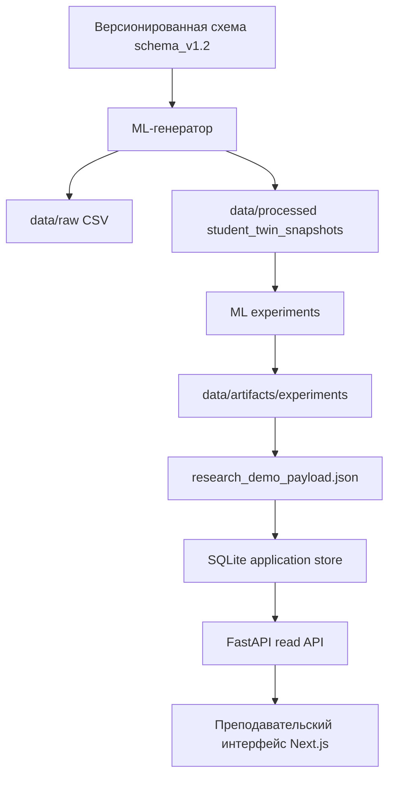

# Стартовый технический гид по проекту

Этот документ объясняет проект `student-digital-twin-xai` с нуля. Он написан
для человека, который умеет читать код и документацию, но еще не знает, как
устроен именно этот репозиторий, зачем здесь нужна схема данных, как работает
конвейер генерации датасета, где появляются снимки Digital Twin, как
эксперименты связаны с пользовательским интерфейсом и почему некоторые вещи
намеренно запрещены.

Если нужен короткий ответ: это исследовательский прототип аналитики для
преподавателя, где синтетические LMS-подобные данные превращаются в недельные
состояния студента, затем используются для предсказания итоговой оценки и
объяснения поведения модели, а готовые экспериментальные результаты
показываются через платформу FastAPI + Next.js, работающую только на чтение.

## Оглавление

1. [Что это за система](#что-это-за-система)
2. [Главная идея: Student Digital Twin](#главная-идея-student-digital-twin)
3. [Как читать репозиторий](#как-читать-репозиторий)
4. [Общий поток данных](#общий-поток-данных)
5. [Почему все начинается со схемы данных](#почему-все-начинается-со-схемы-данных)
6. [Слои данных в `schema_v1.2`](#слои-данных-в-schema_v12)
7. [Ключевые сущности датасета](#ключевые-сущности-датасета)
8. [Как строятся снимки Digital Twin](#как-строятся-снимки-digital-twin)
9. [Целевые переменные, метки и защита от утечки](#целевые-переменные-метки-и-защита-от-утечки)
10. [Как работает ML-часть](#как-работает-ml-часть)
11. [Как результаты попадают в API и интерфейс](#как-результаты-попадают-в-api-и-интерфейс)
12. [Какие данные можно пересоздавать](#какие-данные-можно-пересоздавать)
13. [Что нельзя делать без обновления методологии](#что-нельзя-делать-без-обновления-методологии)
14. [Практический маршрут новичка](#практический-маршрут-новичка)
15. [Карта документов](#карта-документов)

## Что это за система

Проект исследует, можно ли построить понятную для преподавателя аналитическую
систему вокруг трех идей:

| Идея | Что означает в проекте |
| --- | --- |
| Student Digital Twin | Недельное состояние студента, собранное из поведения, успеваемости, посещаемости, дисциплины сдачи работ и признаков освоения материала. |
| Предиктивная аналитика | Модели, которые оценивают будущий итоговый результат, прежде всего `final_grade`. |
| Explainable AI | Объяснения, какие признаки повышают или понижают прогноз модели для конкретного случая. |

Важно: это не полноценная LMS, не Student Information System и не промышленный
edtech-продукт. В проекте нет настоящей интеграции с университетской системой,
нет авторизации и ролей, нет живого цикла переобучения и нет валидированной
симуляции сценариев.

Текущая система нужна для исследовательской демонстрации:

```text
схема данных
  -> синтетический LMS-подобный датасет
  -> недельные снимки Student Digital Twin
  -> ML-эксперименты и XAI-аудит
  -> зафиксированные артефакты
  -> SQLite-проекция
  -> endpoints FastAPI только для чтения
  -> преподавательский интерфейс Next.js
```

Главная аудитория системы - преподаватель или рецензент защиты, который хочет
понять: что известно о студенте к конкретной неделе, какой есть риск, какой
прогноз итоговой оценки, и какие признаки влияют на поведение модели.

Подробнее о границах проекта смотри в [`README.md`](../README.md) и
[`docs/architecture/overview.md`](architecture/overview.md).

### Проверь себя

После этого раздела нужно понимать три вещи:

- проект исследовательский, а не промышленная LMS;
- центральный объект - недельный digital twin студента;
- интерфейс показывает проекцию только для чтения по уже подготовленным данным и артефактам.

## Главная идея: Student Digital Twin

В этом проекте Student Digital Twin - это не 3D-модель и не просто карточка
студента. Это структурированное состояние студента во времени.

Один студент не представлен одной строкой. Вместо этого студент имеет много
недельных снимков:

```text
student_001, week 1 -> состояние после первой недели
student_001, week 2 -> состояние после второй недели
student_001, week 3 -> состояние после третьей недели
...
student_001, week 10 -> состояние после десятой недели
```

Каждый снимок отвечает на вопрос:

> Что система могла бы знать о студенте к концу этой недели, не заглядывая в
> будущее?

Это очень важное ограничение. Если снимок за week 4 использует данные из
week 8 или итоговую оценку за курс, модель будет выглядеть лучше, чем должна.
Это называется утечкой данных. Поэтому итоговые результаты хранятся отдельно от
недельного состояния.

Twin-состояние собирает несколько типов сигналов:

| Семейство признаков | Примеры |
| --- | --- |
| Посещаемость | `attendance_rate_to_date`, `attendance_trend_3w` |
| Академическая performance | `avg_assignment_score_to_date`, `avg_quiz_score_to_date`, `score_trend_3w` |
| Mastery | `current_topic_mastery`, `overall_mastery` |
| Дисциплина сдачи | `on_time_submission_rate_to_date`, `missed_assignments_to_date`, `late_submissions_to_date` |
| Вовлеченность в LMS | `activity_score_to_date`, `time_spent_to_date`, `activity_trend_3w` |
| Составные индексы | `engagement_index`, `performance_index`, `discipline_index` |
| Риск для преподавательского мониторинга | `risk_score`, `risk_level` |

Авторитетное описание признаков находится в
[`docs/data_model/04_feature_definitions.md`](data_model/04_feature_definitions.md).

### Проверь себя

Digital Twin в этом репозитории - это таблица `student_twin_snapshots`, где
зерно данных строго задано как `1 row = 1 student x 1 week`.

## Как читать репозиторий

Репозиторий устроен как monorepo:

```text
services/ml
  Генерация синтетического датасета, построение снимков Digital Twin,
  валидация, ML-эксперименты, XAI и экспорт артефактов.

packages/contracts
  Версионированные YAML-схемы данных и общие TypeScript-типы.

apps/api
  FastAPI backend. Импортирует зафиксированный research payload в SQLite и отдает
  API только для чтения для dashboard, students, twins, predictions, explanations.

apps/web
  Next.js-интерфейс для преподавательских и демонстрационных сценариев защиты.

docs
  Методология, модель данных, архитектура, эксперименты, диссертационный пакет
  и operations-инструкции.

data
  Сгенерированные CSV/Parquet, SQLite-хранилище, отчеты и экспериментальные артефакты.
```

Самое важное правило чтения: если код и документация расходятся, сначала
смотри документацию модели данных и контракт схемы. Порядок авторитетности такой:

1. [`docs/data_model/*`](data_model/)
2. [`packages/contracts/schema_versions/*`](../packages/contracts/schema_versions/)
3. код
4. tests
5. сгенерированные артефакты в `data/`

Это нужно потому, что проект исследовательский. Смысл полей, целевых переменных и меток
важнее, чем текущая удобная реализация в коде.

### Проверь себя

Если непонятно, что означает поле, сначала открывай
[`docs/data_model/02_data_dictionary.md`](data_model/02_data_dictionary.md), а
потом активную YAML-схему
[`schema_v1.2.yaml`](../packages/contracts/schema_versions/schema_v1.2.yaml).

## Общий поток данных

Текущий поток данных можно представить так:



Та же логика словами:

1. Сначала есть контракт данных: какие таблицы существуют, какие поля в них
   допустимы, какие типы и значения ожидаются.
2. Генератор в `services/ml` создает синтетические raw tables: students,
   topics, assignments, attendance, submissions, weekly_activity и final
   results.
3. Из сырых таблиц строится `student_twin_snapshots`: недельная обработанная таблица
   состояния студентов.
4. Validation проверяет, что данные соответствуют `schema_v1.2`.
5. Эксперименты используют снимки и итоговые результаты, но должны соблюдать
   временные отсечения и правила защиты от утечки.
6. Результаты экспериментов сохраняются в `data/artifacts/experiments/<id>/`.
7. Скрипт экспорта собирает payload только для чтения для research demo.
8. API importer загружает payload в SQLite.
9. FastAPI отдает данные через endpoints только для чтения.
10. Next.js показывает интерфейс, ориентированный на преподавателя.

Подробное описание архитектуры находится в
[`docs/architecture/overview.md`](architecture/overview.md). Команды запуска -
в [`RUN_SERVICES.md`](../RUN_SERVICES.md).

### Проверь себя

Пользовательский интерфейс не обучает модель и не пересчитывает эксперименты.
Интерфейс читает API, API читает SQLite-проекцию, а SQLite-проекция строится из
зафиксированного research payload.

## Почему все начинается со схемы данных

В обычном pet-проекте можно начать с CSV и постепенно добавлять колонки. Здесь
так делать нельзя, потому что проект защищает исследовательскую методологию.

Схема данных нужна для четырех причин:

| Причина | Почему это важно |
| --- | --- |
| Повторяемость | Эксперименты должны быть воспроизводимыми, а не зависеть от случайно измененного CSV. |
| Смысл полей | `risk_level`, `final_grade`, `overall_mastery` и другие поля имеют разные методологические роли. |
| Защита от утечки | Схема разделяет недельное состояние и итоговые результаты курса. |
| Эволюция | Новые поля добавляются через новую версию, а не через silent drift. |

Активный контракт сейчас:

```text
packages/contracts/schema_versions/schema_v1.2.yaml
```

Документация к версиям схем:

- [`packages/contracts/schema_versions/README.md`](../packages/contracts/schema_versions/README.md)
- [`docs/data_model/05_change_log.md`](data_model/05_change_log.md)

`schema_v1.2` важна потому, что она методологически разделяет:

- целевые переменные ML: `final_grade`, `passed`;
- эвристическая метка для преподавательского мониторинга: `risk_level`;
- внутренний эвристический балл: `risk_score`;
- недельные признаки, которые можно знать только к конкретной неделе.

### Почему нельзя просто обучать модель на `risk_level`

`risk_level` уже выводится из недельных признаков Digital Twin. Если обучить модель
предсказывать `risk_level`, модель в основном научится повторять текущую
эвристику риска. Это не докажет, что Digital Twin помогает предсказывать
внешний результат.

Поэтому primary regression target - `final_grade`, а `risk_level` остается
мониторинговой меткой для преподавателя. Это подробно объяснено в
[`docs/data_model/03_targets_and_labels.md`](data_model/03_targets_and_labels.md).

### Проверь себя

Схема здесь не просто технический формат. Это защита смысла исследования:
какие поля являются наблюдениями, какие являются недельным состоянием, а какие
являются итоговыми результатами.

## Слои данных в `schema_v1.2`

Data model разделен на три слоя.

```text
Сырой LMS-подобный слой
  -> наблюдения и события, похожие на данные LMS

Обработанный слой Digital Twin
  -> недельные состояния студентов, построенные из raw layer

Слой итоговых результатов
  -> итоговые результаты курса, используемые как supervised targets
```

Такое разделение выбрано намеренно.

### 1. Сырой LMS-подобный слой

Это слой исходных наблюдений. Он похож на то, что можно было бы получить из LMS
или учебной платформы:

- список студентов;
- структура курса по неделям;
- задания и quizzes;
- посещаемость;
- сдачи работ;
- активность в LMS.

Сырой слой не является финальной аналитикой. Это материал, из которого потом
строится недельное состояние Digital Twin.

### 2. Обработанный слой Digital Twin

Главная таблица этого слоя:

```text
student_twin_snapshots
```

Она содержит уже агрегированные, накопительные и трендовые признаки. Например:
не просто отдельные submissions, а `on_time_submission_rate_to_date`; не
отдельные просмотры контента, а `activity_score_to_date`; не итоговая оценка,
а состояние студента на конкретной неделе.

### 3. Слой итоговых результатов

Главная таблица этого слоя:

```text
final_results
```

Она хранит то, что становится известно после завершения курса:

- `final_grade`;
- `passed`;
- `completion_status`.

Слой итоговых результатов отделен от слоя недельных снимков, чтобы недельные
признаки не подглядывали в будущее.

Подробное описание слоев находится в
[`docs/data_model/00_scope.md`](data_model/00_scope.md) и
[`docs/data_model/01_entities.md`](data_model/01_entities.md).

### Проверь себя

Сырые данные - это наблюдения. Снимки Digital Twin - это недельное состояние.
`final_results` - это итог после курса. Эти слои нельзя смешивать без причины.

## Ключевые сущности датасета

Ниже - практическое объяснение основных таблиц.

| Таблица | Слой | Для чего нужна |
| --- | --- | --- |
| `students` | Сырой | Список студентов синтетической когорты и параметры, используемые только генератором. |
| `courses` | Сырой | Контекст курса: длительность, проходной балл, базовая учебная рамка. |
| `course_topics` | Сырой | Недельная структура курса: какая тема соответствует какой неделе. |
| `assignments` | Сырой | Задания, quizzes и lab checks, связанные с темами и неделями дедлайнов. |
| `attendance` | Сырой | Посещаемость студента по учебным сессиям. |
| `submissions` | Сырой | Факт сдачи, опоздание, оценка и attempts по каждому assessment item. |
| `weekly_activity` | Сырой | LMS-активность по неделям: входы, просмотры, практические события, время на платформе. |
| `student_twin_snapshots` | Обработанный | Центральная таблица недельного состояния студента. |
| `final_results` | Итоговый | Реализованные итоги курса: `final_grade`, `passed`, completion. |

### Почему есть поля только для генерации

В `students` есть скрытые параметры вроде `baseline_level`,
`motivation_level`, `discipline_level`, `trajectory_type`. Они нужны генератору,
чтобы синтетические данные были не полностью случайными.

Например, студент с низкой дисциплиной может чаще сдавать поздно, а студент с
сильным базовым уровнем может лучше справляться с заданиями. Это помогает создать
похожую на реальность структуру зависимостей:

```text
скрытые параметры генерации
  -> посещаемость, активность, submissions, scores
  -> недельные признаки Digital Twin
  -> итоговые результаты
```

Но эти поля генерации не должны становиться признаками для преподавательского
интерфейса и не должны использоваться как честные ML-признаки. Это внутренний
механизм генерации синтетики.

### Почему `course_topics` важны

Без `course_topics` датасет был бы просто набором событий. С темами появляется
учебная временная линия:

```text
week 1 -> тема 1
week 2 -> тема 2
...
week 10 -> тема 10
```

Это позволяет строить `current_topic_mastery`, `overall_mastery`,
сложность темы и недельные снимки.

### Почему `submissions` и `attendance` разделены

Посещаемость, сдача работ и LMS-активность - разные поведенческие каналы.
Студент может посещать занятия, но не сдавать вовремя. Или сдавать задания, но
мало взаимодействовать с платформой. Разделение сырых таблиц позволяет потом
проверять, какие блоки признаков реально полезны.

### Проверь себя

Сущности не являются случайным набором таблиц. Они поддерживают конкретную
исследовательскую конструкцию: недельный Digital Twin для преподавателя.

## Как строятся снимки Digital Twin

`student_twin_snapshots` строится из сырых данных. Каждый снимок должен
использовать только данные, доступные к концу соответствующей недели.

Пример для студента `S001` на week 4:

```text
можно использовать:
  attendance weeks 1-4
  submissions due by week 4
  weekly_activity weeks 1-4
  topics weeks 1-4

нельзя использовать:
  attendance week 5+
  будущие submissions
  final_grade
  passed
  экспериментальные explanations
```

Снимок содержит несколько типов расчетов:

| Тип | Пример | Смысл |
| --- | --- | --- |
| Накопительный расчет | `time_spent_to_date` | Все, что накопилось до текущей недели. |
| Доля или частота | `attendance_rate_to_date` | Доля или частота по данным до текущей недели. |
| Тренд | `activity_trend_3w` | Недавнее направление изменения. |
| Mastery | `overall_mastery` | Прокси усвоения материала. |
| Составной индекс | `engagement_index` | Объяснимое агрегирование нескольких сигналов. |
| Эвристический риск | `risk_score`, `risk_level` | Мониторинговая оценка текущей академической обеспокоенности. |

### Почему снимки недельные, а не ежедневные

Недельное зерно выбрано как компромисс:

- достаточно частый, чтобы видеть ранние сигналы риска;
- достаточно стабильный, чтобы признаки не были слишком шумными;
- естественно совпадает с учебной структурой курса;
- удобен для преподавательского мониторинга.

В текущем охвате это одна синтетическая course-like среда с 10 неделями по
базовому контракту. Операционные скрипты могут генерировать большие локальные
варианты для проверок масштаба, но это не меняет каноническую интерпретацию
`schema_v1.2`.

### Проверь себя

Главный вопрос защиты от утечки для любого снимка: можно ли было знать это
значение к концу этой недели? Если нет, поле не должно попадать в снимок.

## Целевые переменные, метки и защита от утечки

В проекте есть три похожих, но методологически разных понятия:

| Поле | Где живет | Роль |
| --- | --- | --- |
| `final_grade` | `final_results` | Главная целевая переменная для регрессии. |
| `passed` | `final_results` | Вторичная целевая переменная для классификации и контекста. |
| `risk_level` | `student_twin_snapshots` | Эвристическая метка для преподавателя, не истинная целевая переменная ML. |

### `final_grade`

`final_grade` - это итоговая числовая оценка курса. Она известна только после
завершения курса и используется как главная целевая переменная регрессии в
синтетических экспериментах.

Она не должна быть признаком внутри недельных снимков.

### `passed`

`passed` выводится из `final_grade` и проходного балла курса. Это целевая
переменная классификации, но в текущей линии экспериментов она оказалась менее
информативной, потому что может насыщаться. Поэтому основные утверждения
держатся на целевой переменной регрессии
`final_grade`.

### `risk_level`

`risk_level` - это недельная метка академического риска для преподавателя:

- `low`;
- `medium`;
- `high`.

Он выводится из `risk_score`, который, в свою очередь, строится из недельных
признаков Digital Twin. Поэтому `risk_level` нельзя использовать как целевую
переменную supervised learning для доказательства полезности модели. Это
привело бы к круговой проверке: модель учится повторять эвристику, а не
предсказывать независимый итоговый результат.

### Правила защиты от утечки

Нельзя допускать:

- `final_grade` как признак;
- `passed` как признак;
- будущие недели внутри раннего снимка;
- `risk_level` как целевая переменная обучения с учителем;
- скрытые параметры генерации как честные признаки модели;
- артефакты объяснений как входные признаки.

Экспериментальные наборы признаков дополнительно защищают это на уровне кода.
Описание целевых переменных находится в
[`docs/data_model/03_targets_and_labels.md`](data_model/03_targets_and_labels.md),
а методологическое обоснование - в
[`docs/dissertation/methodological_justification_of_model_and_experiment_design.md`](dissertation/methodological_justification_of_model_and_experiment_design.md).

### Проверь себя

`final_grade` - внешний итоговый результат. `risk_level` - внутренняя недельная
эвристика для преподавателя. Это разные вещи, даже если обе связаны с риском.

## Как работает ML-часть

ML-код находится в `services/ml`. Его задача шире, чем просто обучить одну
модель. Он поддерживает полный исследовательский конвейер.

```text
services/ml
  src/generator       -> генерация сырых таблиц
  src/features        -> логика признаков
  src/validation      -> проверки по схеме и аудиты правдоподобия
  src/training        -> утилиты baseline-обучения
  src/experiments     -> runners для exp_001 ... exp_005
  src/explainability  -> логика объяснений
  src/export          -> экспорт payload для research demo
  src/benchmarks      -> адаптеры публичных benchmark-датасетов, включая OULAD
```

Подробный операционный README находится в
[`services/ml/README.md`](../services/ml/README.md).

### Генератор датасета

Генератор создает синтетические LMS-подобные данные. Он не должен быть полностью
рандомным. Идея такая:

```text
скрытый синтетический профиль студента
  -> правдоподобные паттерны посещаемости, активности, сдач и успеваемости
  -> недельные снимки
  -> итоговый результат
```

Это нужно, чтобы данные были пригодны для проверки исследовательского конвейера:

- есть связь между посещаемостью, активностью, успеваемостью и итоговым результатом;
- есть разные траектории студентов;
- есть ранние сигналы риска;
- есть пропуски данных, которые нужно отличать от ошибки данных.

Запуск описан в [`RUN_SERVICES.md`](../RUN_SERVICES.md) и
[`docs/operations/research-data-workflows.md`](operations/research-data-workflows.md).

### Валидация

Валидация проверяет два уровня:

1. Соответствие контракту схемы.
2. Проверки правдоподобия: выглядят ли распределения и связи правдоподобно для
   исследовательского прототипа.

Валидация не доказывает, что данные являются реальными. Она проверяет, что
синтетический датасет достаточно структурирован и не сломан для текущих
экспериментов.

### Экспериментальная линия

Текущая диссертационная линия экспериментов завершена:

| ID | Смысл |
| --- | --- |
| `exp_001_baseline` | Сравнить `A_simple`, `B_lms`, `C_twin`. |
| `exp_002_twin_ablation` | Проверить, какие блоки Digital Twin добавляют пользу. |
| `exp_003_mastery_validation` | Проверить mastery-блок и риск избыточности. |
| `exp_004_xai_on_lean_twin` | Сделать XAI-аудит компактного кандидата Digital Twin. |
| `exp_005_public_benchmark_oulad` | Проверить переносимость на benchmark OULAD. |

Канонический индекс экспериментов:
[`docs/experiments/registry.md`](experiments/registry.md).

### Почему полный Digital Twin не обязательно лучший

Один из важных результатов проекта: больше признаков не всегда лучше. Полное
представление Digital Twin не победило LMS baseline надежно. Поэтому проект
перешел к ablation: какие части Digital Twin действительно добавляют сигнал?

Текущая защищаемая позиция: компактный кандидат Digital Twin, особенно
mastery-centered subset, полезнее для утверждений, чем тезис, что весь полный
Digital Twin всегда лучше.

### XAI

XAI-часть объясняет поведение модели, а не причинность. Если объяснение
говорит, что признак повышает прогноз, это значит:

```text
в поведении текущей модели этот признак связан с повышением прогноза
```

Это не значит:

```text
если преподаватель изменит этот признак, итоговая оценка причинно изменится
```

В текущем проекте нет валидированной причинной симуляции вмешательств.

### Benchmark OULAD

OULAD используется как внешний публичный benchmark, но это не тот же самый
датасет и не та же самая схема. Для него используется adapter schema и
производная целевая переменная. Поэтому OULAD нужен как stress test
переносимости, а не как прямое подтверждение всех утверждений по синтетике.

### Проверь себя

ML-часть не просто тренирует модель. Она создает данные, проверяет контракт,
проводит эксперименты, сохраняет артефакты и готовит payload для интерфейса,
работающего только на чтение.

## Как результаты попадают в API и интерфейс

После экспериментов проект не заставляет интерфейс читать все CSV/JSON
артефакты напрямую. Вместо этого есть отдельный конвейер проекции.

```text
data/artifacts/experiments/**
  -> services/ml/src/export/export_research_demo_payload.py
  -> data/artifacts/research_demo/research_demo_payload.json
  -> apps/api/src/import_research_payload.py
  -> data/application/research_platform.sqlite
  -> FastAPI /api/*
  -> Next.js pages
```

### Почему нужен `research_demo_payload.json`

Экспериментальные артефакты удобны для исследователя, но неудобны для
интерфейса. Они могут быть разбросаны по папкам экспериментов, иметь разные
CSV/JSON/Markdown формы и
быть слишком низкоуровневыми.

`research_demo_payload.json` - это подготовленный seed только для чтения для
платформы. Он собирает только то, что нужно показать в демонстрационном
интерфейсе защиты.

### Почему нужен SQLite

SQLite в `data/application/` - это локальная прикладная проекция. Она не
является промышленной базой данных и не является новым источником истины. Ее
можно пересоздать из зафиксированного payload.

API README:
[`apps/api/README.md`](../apps/api/README.md).

### Что отдает FastAPI

FastAPI предоставляет endpoints только для чтения для:

- статуса платформы;
- dashboard;
- students;
- twins;
- predictions;
- explanations;
- исследовательских evidence.

Backend организован по предметным областям: внутри каждой области есть свои
границы router/service/repository/models.

### Что делает Next.js

Next.js-интерфейс в `apps/web` показывает преподавательский сценарий:

- центр управления;
- triage dashboard;
- список студентов;
- детали Digital Twin студента;
- predictions;
- примеры объяснений;
- исследовательские evidence для demo.

Интерфейс должен быть честным: если данных нет, он показывает состояние
недоступности или пустого результата, а не выдуманные charts.

### Проверь себя

API и интерфейс - это слой только для чтения поверх зафиксированных evidence.
Они нужны для демонстрации и сценария рецензирования, а не для изменения
исследовательских результатов.

## Какие данные можно пересоздавать

В проекте есть пересоздаваемые данные и канонические экспериментальные артефакты.

Можно пересоздавать:

| Путь | Что это |
| --- | --- |
| `data/raw/*` | Сгенерированные сырые LMS-подобные CSV. |
| `data/processed/*` | Сгенерированные снимки Digital Twin в CSV/Parquet. |
| `data/application/*` | SQLite-хранилище приложения. |
| `data/artifacts/research_demo/*` | Payload для начального наполнения интерфейса. |
| `data/artifacts/eda/*` | Выходы EDA. |
| `data/artifacts/reports/*` | Отчеты правдоподобия и сравнения. |

Нельзя случайно удалять или перезаписывать:

```text
data/artifacts/experiments/**
```

Это зафиксированные evidence для диссертационной линии. Если меняется размер
датасета, версия схемы, набор признаков, целевая переменная, стратегия split
или семейство модели, нужен новый experiment ID. Старые `exp_001` ... `exp_005`
нельзя тихо подменять.

Для локальной пересборки есть скрипты:

- [`docs/operations/research-data-workflows.md`](operations/research-data-workflows.md)
- [`scripts/README.md`](../scripts/README.md)

Типичный сухой запуск:

```powershell
.\scripts\Reset-RebuildableData.ps1
```

Полная пересборка пересоздаваемых данных:

```powershell
.\scripts\Rebuild-ResearchData.ps1 -Preset large -Seed 123 -Apply
```

Эта команда полезна для проверки интерфейса на большем масштабе. Она не является новой полной
экспериментальной валидацией гипотезы.

### Проверь себя

Пересоздать generated data можно. Перезаписать канонические experiment evidence
нельзя без нового experiment ID и обновления документации.

## Что нельзя делать без обновления методологии

Эти правила защищают проект от методологической путаницы.

| Нельзя | Почему |
| --- | --- |
| Менять поля схемы молча | Сломается контракт и смысл данных. |
| Использовать `risk_level` как целевую переменную обучения с учителем | Это недельная эвристика, а не внешний итоговый результат. |
| Подмешивать `final_grade` в недельные признаки | Это утечка из будущего. |
| Перезаписывать `data/artifacts/experiments/<exp_id>/` | Старые результаты перестанут быть воспроизводимыми. |
| Притворяться, что explanations являются причинными утверждениями | XAI объясняет поведение модели, а не причинность. |
| Делать charts без данных | Это создает фальшивые evidence. |
| Добавлять LMS/auth/product-сценарии без запроса | Охват проекта - аналитика для преподавателя и исследовательский прототип. |

Если реально нужно изменить модель данных, порядок такой:

1. Обновить соответствующий документ в [`docs/data_model/`](data_model/).
2. Обновить schema YAML в
   [`packages/contracts/schema_versions/`](../packages/contracts/schema_versions/).
3. Обновить журнал изменений:
   [`docs/data_model/05_change_log.md`](data_model/05_change_log.md).
4. Потом менять генератор, валидацию, эксперименты, API и интерфейс.

### Проверь себя

В этом проекте код идет после методологии, а не наоборот. Если меняется смысл
поля, сначала меняются документация и контракты.

## Практический маршрут новичка

Если ты впервые открываешь проект, иди таким маршрутом.

### Шаг 1. Понять предметную область

Прочитай:

- [`README.md`](../README.md)
- [`docs/data_model/00_scope.md`](data_model/00_scope.md)
- [`docs/data_model/01_entities.md`](data_model/01_entities.md)

Цель: понять, что система ориентирована на преподавателя, синтетическая,
недельная и исследовательская.

### Шаг 2. Понять схему

Прочитай:

- [`docs/data_model/02_data_dictionary.md`](data_model/02_data_dictionary.md)
- [`docs/data_model/03_targets_and_labels.md`](data_model/03_targets_and_labels.md)
- [`docs/data_model/04_feature_definitions.md`](data_model/04_feature_definitions.md)
- [`packages/contracts/schema_versions/schema_v1.2.yaml`](../packages/contracts/schema_versions/schema_v1.2.yaml)

Цель: понимать, где сырые поля, где признаки Digital Twin, где итоговые
результаты.

### Шаг 3. Понять ML-конвейер

Прочитай:

- [`services/ml/README.md`](../services/ml/README.md)
- [`docs/experiments/registry.md`](experiments/registry.md)
- [`docs/experiments/README.md`](experiments/README.md)

Цель: понять, какие эксперименты уже завершены и почему позиция компактного
Digital Twin важнее, чем наивное утверждение о полном Digital Twin.

### Шаг 4. Понять приложение

Прочитай:

- [`docs/architecture/overview.md`](architecture/overview.md)
- [`apps/api/README.md`](../apps/api/README.md)
- [`RUN_SERVICES.md`](../RUN_SERVICES.md)

Цель: понять, как зафиксированный payload попадает в SQLite, FastAPI и Next.js.

### Шаг 5. Понять операции с данными

Прочитай:

- [`docs/operations/research-data-workflows.md`](operations/research-data-workflows.md)
- [`scripts/README.md`](../scripts/README.md)

Цель: безопасно пересоздавать пересоздаваемые данные и не трогать
канонические экспериментальные артефакты.

### Шаг 6. Понять диссертационные утверждения

Прочитай:

- [`docs/dissertation/README.md`](dissertation/README.md)
- [`docs/dissertation/core_claims_and_nonclaims.md`](dissertation/core_claims_and_nonclaims.md)
- [`docs/dissertation/defense_qna.md`](dissertation/defense_qna.md)

Цель: понимать, какие утверждения проект делает, а какие сознательно не делает.

## Карта документов

| Если нужно понять... | Читать |
| --- | --- |
| Общую идею проекта | [`README.md`](../README.md) |
| Границы модели данных | [`docs/data_model/00_scope.md`](data_model/00_scope.md) |
| Сущности и связи | [`docs/data_model/01_entities.md`](data_model/01_entities.md) |
| Поля таблиц | [`docs/data_model/02_data_dictionary.md`](data_model/02_data_dictionary.md) |
| Целевые переменные и метки | [`docs/data_model/03_targets_and_labels.md`](data_model/03_targets_and_labels.md) |
| Признаки Digital Twin | [`docs/data_model/04_feature_definitions.md`](data_model/04_feature_definitions.md) |
| Историю изменений модели данных | [`docs/data_model/05_change_log.md`](data_model/05_change_log.md) |
| Активный контракт схемы | [`schema_v1.2.yaml`](../packages/contracts/schema_versions/schema_v1.2.yaml) |
| Архитектуру системы | [`docs/architecture/overview.md`](architecture/overview.md) |
| ML-сервис | [`services/ml/README.md`](../services/ml/README.md) |
| API-сервис | [`apps/api/README.md`](../apps/api/README.md) |
| Запуск сервисов | [`RUN_SERVICES.md`](../RUN_SERVICES.md) |
| Скрипты сброса и генерации данных | [`docs/operations/research-data-workflows.md`](operations/research-data-workflows.md) |
| Эксперименты | [`docs/experiments/registry.md`](experiments/registry.md) |
| Диссертационный пакет | [`docs/dissertation/README.md`](dissertation/README.md) |

## Финальная ментальная модель

Если свести проект к одной картине, она такая:

```text
schema_v1.2 задает, какие данные допустимы и что они означают

services/ml генерирует синтетические LMS-подобные данные

из сырых данных строится недельная таблица student_twin_snapshots

final_results хранит итоговые результаты отдельно от недельного состояния

ML-эксперименты проверяют, какие наборы признаков помогают предсказывать final_grade

XAI объясняет поведение модели, но не делает причинных утверждений

экспериментальные артефакты заморожены как evidence

research_demo_payload и SQLite делают evidence удобными для API только на чтение

FastAPI и Next.js показывают преподавательский demo-сценарий для защиты
```

Главный принцип: система должна быть методологически честной. Лучше показать
ограничение явно, чем построить красивый, но недоказанный продуктовый сценарий.
